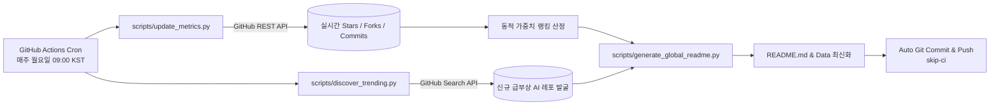

# 🌐 Awesome Global AI Vault & Weekly Leaderboard

> **전 세계 최상위 오픈소스 AI 생성물·에이전트·파운데이션 모델 100선 및 주간 자동 랭킹 레이더**
> 매주 월요일 09:00 KST, GitHub Actions가 100개 레포지토리의 실시간 Stars/Forks/최근 커밋일을 수집하여 동적 순위와 신규 급부상 프로젝트를 자동으로 최신화합니다.

[](https://github.com/daeryundf2-prog/awesome-global-ai-vault/actions/workflows/weekly-sync.yml) 
 
 


---

## 🏆 1. Global AI Weekly Top 20 Leaderboard (실시간 글로벌 랭킹)

GitHub 실시간 메트릭(Stars, Forks)과 최근 커밋 활동성(Recency Bonus)을 종합 반영한 글로벌 주간 랭킹입니다.

| 순위 | 변동 | 상태 | 프로젝트명 | 권역 | 카테고리 | Stars | Forks | 활동 점수 | 핵심 특징 및 활용처 | 링크 |
|:---:|:---:|:---:|---|---|---|:---:|:---:|:---:|---|:---:|
| **#01** | `−` | 🔥 Hot | **openclaw** | 북미 / 글로벌 | 에이전트 하네스 & 자율 실행 | ⭐ `390,314` | 🍴 `82,103` | **80.74** | 2026년 급부상한 범용 제너럴리스트 에이전트. 랍스터(Lobster) 아키텍처 기반 자율 태스크 분기 | [GitHub](https://github.com/openclaw/openclaw) |
| **#02** | `−` | 🔥 Hot | **hermes-agent** | 북미 / 글로벌 | 에이전트 하네스 & 자율 실행 | ⭐ `248,239` | 🍴 `52,421` | **78.39** | 자율적인 스킬 학습 및 영구 누적을 특징으로 하는 적응형 에이전트 하네스 | [GitHub](https://github.com/nousresearch/hermes-agent) |
| **#03** | `−` | 🔥 Hot | **n8n** | 북미 / 글로벌 | 워크플로우 & 파이프라인 오케스트레이션 | ⭐ `205,751` | 🍴 `60,857` | **77.7** | 수백 개의 SaaS와 데이터베이스를 AI 에이전트 노드로 연결하는 오픈소스 비주얼 워크플로우 플랫폼 | [GitHub](https://github.com/n8n-io/n8n) |
| **#04** | `▲82` | 🔥 Hot | **deepseek-harness** | 중국권 | 에이전트 하네스 & 자율 실행 | ⭐ `233,975` | 🍴 `28,111` | **77.59** | Cordis 설계를 도입하여 모델, 툴, 세션, 루프 전부를 플러그인으로 갈아끼우는 프레임워크 독립형 하네스 | [GitHub](https://github.com/deepseek-ai/deepseek-harness) |
| **#05** | `▼1` | 🔥 Hot | **AutoGPT** | 북미 / 글로벌 | 에이전트 벤치마크 & 하네스 | ⭐ `187,505` | 🍴 `45,998` | **77.06** | 자율 에이전트의 시초이자 현재는 에이전트 빌더, 블록 기반 워크플로우, 벤치마킹을 아우르는 오픈 플랫폼 | [GitHub](https://github.com/Significant-Gravitas/AutoGPT) |
| **#06** | `▼1` | 🔥 Hot | **transformers** | 유럽권 | 모델 허브 & 생태계 | ⭐ `166,557` | 🍴 `34,662` | **76.3** | 현대 AI 오픈소스 생태계의 기틀. 전 세계 수십만 개의 사전학습 모델을 다운로드하고 추론하는 표준 라이브러리 | [GitHub](https://github.com/huggingface/transformers) |
| **#07** | `▼1` | 🔥 Hot | **ollama** | 북미 / 글로벌 | 로컬 인퍼런스 & 서빙 인프라 | ⭐ `181,510` | 🍴 `17,976` | **76.1** | Mac, Linux, Windows에서 Llama, Qwen, DeepSeek 오픈 모델을 한 줄 명령으로 다운로드 및 실행하는 사실상 글로벌 표준 | [GitHub](https://github.com/ollama/ollama) |
| **#08** | `▼1` | 🔥 Hot | **dify** | 중국권 | 워크플로우 & 에이전트 플랫폼 | ⭐ `156,948` | 🍴 `24,742` | **75.74** | 비주얼 오케스트레이션, RAG 파이프라인, 에이전트 워크플로우를 완성형 웹 앱으로 즉시 배포하는 글로벌 리딩 플랫폼 | [GitHub](https://github.com/langgenius/dify) |
| **#09** | `▼1` | 🔥 Hot | **llama.cpp** | 북미 / 글로벌 | 로컬 인퍼런스 & 서빙 인프라 | ⭐ `129,285` | 🍴 `23,623` | **74.86** | GGUF 양자화 포맷의 원조. 일반 CPU와 통합 메모리 GPU에서 대규모 모델을 돌릴 수 있게 만든 오픈 인프라 | [GitHub](https://github.com/ggerganov/llama.cpp) |
| **#10** | `▼1` | 🔥 Hot | **ComfyUI** | 북미 / 글로벌 | 생성형 미디어 & 노드 UI | ⭐ `134,612` | 🍴 `15,946` | **74.7** | 가장 강력하고 모듈화된 노드 기반 생성형 이미지/비디오 워크플로우 런타임. 에이전트 API 연동 표준 | [GitHub](https://github.com/comfyanonymous/ComfyUI) |
| **#11** | `▼1` | 🔥 Hot | **browser-use** | 북미 / 글로벌 | 브라우저 조작 & 웹 자동화 | ⭐ `116,027` | 🍴 `12,773` | **73.86** | AI가 사람처럼 브라우저를 띄워 클릭, 스크롤, 양식 제출, 로그인, 데이터 수집을 완결하는 웹 에이전트 | [GitHub](https://github.com/browser-use/browser-use) |
| **#12** | `▼1` | 🔥 Hot | **vllm** | 북미 / 글로벌 | 로컬 인퍼런스 & 서빙 인프라 | ⭐ `92,500` | 🍴 `22,564` | **73.37** | PagedAttention 기반으로 메모리 낭비를 없애고 처리량을 최대 24배 끌어올린 오픈소스 프로덕션 서빙 엔진 | [GitHub](https://github.com/vllm-project/vllm) |
| **#13** | `▼1` | 🔥 Hot | **ragflow** | 중국권 | 엔터프라이즈 RAG 엔진 | ⭐ `91,209` | 🍴 `10,812` | **72.67** | 문서의 템플릿과 레이아웃을 깊이 이해하여 표와 단락이 엉키지 않도록 청킹하는 차세대 오픈소스 RAG | [GitHub](https://github.com/infiniflow/ragflow) |
| **#14** | `▼1` | 🔥 Hot | **PaddleOCR** | 중국권 | 광학 문자 인식 (OCR) | ⭐ `90,069` | 🍴 `11,395` | **72.66** | 80개 이상 언어를 지원하는 초경량, 고정밀 산업용 OCR. 다단 표 및 영수증 텍스트 추출의 글로벌 최강자 | [GitHub](https://github.com/PaddlePaddle/PaddleOCR) |
| **#15** | `▼1` | 🔥 Hot | **MinerU** | 중국권 | 문서 변환 & 구조화 | ⭐ `80,519` | 🍴 `6,722` | **71.71** | 복잡한 비정형 PDF, 오피스 문서, 학술 논문을 마크다운/JSON으로 완벽 추출하여 RAG 병목을 해결한 1위 도구 | [GitHub](https://github.com/opendatalab/MinerU) |
| **#16** | `▼1` | 🔥 Hot | **unsloth** | 유럽권 | 초고속 모델 파인튜닝 | ⭐ `76,613` | 🍴 `7,012` | **71.53** | 파이토치 연산을 수작업으로 최적화하여 LLM 파인튜닝 속도를 5배 빠르게, VRAM 사용량을 80% 줄인 영국 명품 툴 | [GitHub](https://github.com/unslothai/unsloth) |
| **#17** | `▼1` | 🔥 Hot | **mem0** | 북미 / 글로벌 | 에이전트 메모리 & 상태 관리 | ⭐ `65,877` | 🍴 `7,741` | **70.96** | 사용자의 과거 대화, 선호도, 사실 관계를 지속적으로 갱신하고 인덱싱하는 개인화 메모리 레이어 | [GitHub](https://github.com/mem0ai/mem0) |
| **#18** | `▼1` | 🔥 Hot | **AnythingLLM** | 유럽권 | 프라이버시 중심 올인원 AI | ⭐ `66,359` | 🍴 `7,389` | **70.96** | GDPR 및 완전 프라이버시를 보장하는 데스크톱/서버 AI 앱. 문서 드래그 앤 드롭 RAG, 다중 사용자 권한 관리 | [GitHub](https://github.com/Mintplex-Labs/anything-llm) |
| **#19** | `▼1` | 🔥 Hot | **crewAI** | 북미 / 글로벌 | 워크플로우 & 파이프라인 오케스트레이션 | ⭐ `58,935` | 🍴 `8,553` | **70.57** | 기획자, 리서처, 작가 등 명확한 직책(Role)과 목표(Goal)를 부여해 가상의 팀을 조직하는 에이전트 프레임워크 | [GitHub](https://github.com/crewAIInc/crewAI) |
| **#20** | `▼1` | 🔥 Hot | **llama_index** | 북미 / 글로벌 | 데이터 인제스천 & RAG | ⭐ `52,292` | 🍴 `8,202` | **70.01** | PDF, 노션, DB 등 방대한 비정형 데이터를 에이전트가 탐색 가능한 인덱스로 연결하는 RAG 표준 | [GitHub](https://github.com/run-llama/llama_index) |

---

## 🛰️ 2. Weekly Radar Emerging Candidates (새롭게 포착된 유망 신규 AI)

GitHub Search API를 통해 최근 1~2주간 스타 급증세가 포착된 미등록 신규 AI 오픈소스 프로젝트입니다:

| 프로젝트명 | 언어 | Stars | Forks | 소개 | 저장소 링크 |
|---|:---:|:---:|:---:|---|:---:|
| **ECC** | `JavaScript` | ⭐ `265,779` | 🍴 `39,717` | The agent harness performance optimization system. Skills, instincts, memory, security, and research-first development for Claude Code, Codex, Opencode, Cursor and beyond. | [GitHub](https://github.com/affaan-m/ECC) |
| **JavaGuide** | `JavaScript` | ⭐ `158,830` | 🍴 `46,140` | Java 面试 & 后端通用面试指南，覆盖计算机基础、数据库、分布式、高并发、系统设计与 AI 应用开发 | [GitHub](https://github.com/Snailclimb/JavaGuide) |
| **open-webui** | `Python` | ⭐ `152,889` | 🍴 `22,370` | User-friendly AI Interface (Supports Ollama, OpenAI API, ...) | [GitHub](https://github.com/open-webui/open-webui) |
| **TradingAgents** | `Python` | ⭐ `108,236` | 🍴 `20,718` | TradingAgents: Multi-Agents LLM Financial Trading Framework | [GitHub](https://github.com/TauricResearch/TradingAgents) |
| **taste-skill** | `JavaScript` | ⭐ `89,452` | 🍴 `6,082` | Taste-Skill - gives your AI good taste. stops the AI from generating boring, generic slop  | [GitHub](https://github.com/Leonxlnx/taste-skill) |
| **OpenHands** | `TypeScript` | ⭐ `88,953` | 🍴 `11,704` | 🙌 OpenHands: AI-Driven Development | [GitHub](https://github.com/OpenHands/OpenHands) |
| **Real-Time-Voice-Cloning** | `Python` | ⭐ `60,146` | 🍴 `9,383` | Clone a voice in 5 seconds to generate arbitrary speech in real-time | [GitHub](https://github.com/CorentinJ/Real-Time-Voice-Cloning) |
| **TTS** | `Python` | ⭐ `46,051` | 🍴 `6,159` | 🐸💬 - a deep learning toolkit for Text-to-Speech, battle-tested in research and production | [GitHub](https://github.com/coqui-ai/TTS) |

---

## 🌍 3. 전세계 4대 권역별 100선 랭킹 일람

1. [🇺🇸 북미 / 글로벌 (North America & Global) (40선)](#reg-us)
2. [🇨🇳 중국권 (China & Greater Asia) (30선)](#reg-cn)
3. [🇪🇺 유럽권 (Europe) (20선)](#reg-eu)
4. [🇯🇵 일본 및 아태지역 (Japan & APAC) (10선)](#reg-jp)

<a id="reg-us"></a>
### 🇺🇸 북미 / 글로벌 (North America & Global) (40선)

| 권역순위 | 통합순위 | 상태 | 도구/프로젝트명 | 개발/조직 | 호환 모델 | Stars | 핵심 설명 및 실무 활용처 | 저장소 링크 |
|:---:|:---:|:---:|---|---|---|:---:|---|:---:|
| **#1** | `#1` | 🔥 Hot | **openclaw** | openclaw | `Claude Opus 5.5 / GPT-6 Astra / Llama 3.3` | ⭐ `390,314` | **2026년 급부상한 범용 제너럴리스트 에이전트. 랍스터(Lobster) 아키텍처 기반 자율 태스크 분기**<br>👉 *복잡한 웹 탐색, 코드 수정, 파일 시스템 조작을 단일 목표 지시로 자율 완결할 때* | [GitHub](https://github.com/openclaw/openclaw) |
| **#2** | `#2` | 🔥 Hot | **hermes-agent** | NousResearch | `Hermes 3 / Claude Code / Codex` | ⭐ `248,239` | **자율적인 스킬 학습 및 영구 누적을 특징으로 하는 적응형 에이전트 하네스**<br>👉 *세션을 거듭할수록 팀의 특정 도메인 워크플로우에 맞춰 스스로 스킬을 학습하게 할 때* | [GitHub](https://github.com/nousresearch/hermes-agent) |
| **#3** | `#3` | 🔥 Hot | **n8n** | n8n.io | `Multi-LLM / LangChain 연동` | ⭐ `205,751` | **수백 개의 SaaS와 데이터베이스를 AI 에이전트 노드로 연결하는 오픈소스 비주얼 워크플로우 플랫폼**<br>👉 *슬랙, 노션, 세일즈포스, 이메일 간 복잡한 비즈니스 로직에 AI 판단 노드를 얹어 자동화할 때* | [GitHub](https://github.com/n8n-io/n8n) |
| **#4** | `#5` | 🔥 Hot | **AutoGPT** | Significant-Gravitas | `Multi-LLM` | ⭐ `187,505` | **자율 에이전트의 시초이자 현재는 에이전트 빌더, 블록 기반 워크플로우, 벤치마킹을 아우르는 오픈 플랫폼**<br>👉 *다양한 모델의 자율 문제 해결 성공률을 표준 벤치마크로 측정할 때* | [GitHub](https://github.com/Significant-Gravitas/AutoGPT) |
| **#5** | `#7` | 🔥 Hot | **ollama** | Ollama Official | `Llama, Qwen, DeepSeek, Mistral` | ⭐ `181,510` | **Mac, Linux, Windows에서 Llama, Qwen, DeepSeek 오픈 모델을 한 줄 명령으로 다운로드 및 실행하는 사실상 글로벌 표준**<br>👉 *로컬 개발 환경에서 GPU 가속을 활용해 오프라인 LLM 서빙 및 로컬 에이전트 백엔드 구축* | [GitHub](https://github.com/ollama/ollama) |
| **#6** | `#9` | 🔥 Hot | **llama.cpp** | Georgi Gerganov | `GGUF Quantized Models` | ⭐ `129,285` | **GGUF 양자화 포맷의 원조. 일반 CPU와 통합 메모리 GPU에서 대규모 모델을 돌릴 수 있게 만든 오픈 인프라**<br>👉 *Ollama, Jan, LM Studio 등 전 세계 모든 로컬 AI 앱의 핵심 구동 엔진* | [GitHub](https://github.com/ggerganov/llama.cpp) |
| **#7** | `#10` | 🔥 Hot | **ComfyUI** | comfyanonymous | `Flux, SDXL, Video Diffusion` | ⭐ `134,612` | **가장 강력하고 모듈화된 노드 기반 생성형 이미지/비디오 워크플로우 런타임. 에이전트 API 연동 표준**<br>👉 *AI 이미지/영상 생성 파이프라인을 완전 자동화된 백엔드 API로 래핑하여 에이전트와 결합할 때* | [GitHub](https://github.com/comfyanonymous/ComfyUI) |
| **#8** | `#11` | 🔥 Hot | **browser-use** | browser-use | `Claude 3.7 / Opus 5.5 / GPT-6 Astra` | ⭐ `116,027` | **AI가 사람처럼 브라우저를 띄워 클릭, 스크롤, 양식 제출, 로그인, 데이터 수집을 완결하는 웹 에이전트**<br>👉 *API가 없는 웹사이트 예약, 티켓팅, 경쟁사 가격 모니터링, 웹 기반 SaaS 자동 조작* | [GitHub](https://github.com/browser-use/browser-use) |
| **#9** | `#12` | 🔥 Hot | **vllm** | UC Berkeley LMSYS | `All Open-weight LLMs` | ⭐ `92,500` | **PagedAttention 기반으로 메모리 낭비를 없애고 처리량을 최대 24배 끌어올린 오픈소스 프로덕션 서빙 엔진**<br>👉 *대규모 사내 서빙 클러스터에서 수백 명의 동시 에이전트 요청을 고속 처리할 때* | [GitHub](https://github.com/vllm-project/vllm) |
| **#10** | `#17` | 🔥 Hot | **mem0** | Mem0 Official | `Multi-LLM / Graph + Vector` | ⭐ `65,877` | **사용자의 과거 대화, 선호도, 사실 관계를 지속적으로 갱신하고 인덱싱하는 개인화 메모리 레이어**<br>👉 *모든 에이전트 애플리케이션에 '사용자를 기억하는 영구 기억 장치'를 1줄 코드로 추가할 때* | [GitHub](https://github.com/mem0ai/mem0) |
| **#11** | `#19` | 🔥 Hot | **crewAI** | CrewAI Official | `Multi-LLM / Claude / OpenAI` | ⭐ `58,935` | **기획자, 리서처, 작가 등 명확한 직책(Role)과 목표(Goal)를 부여해 가상의 팀을 조직하는 에이전트 프레임워크**<br>👉 *시장 조사 보고서 작성, 뉴스레터 발행 파이프라인을 3~4명의 전문 가상 직원 팀으로 실행* | [GitHub](https://github.com/crewAIInc/crewAI) |
| **#12** | `#20` | 🔥 Hot | **llama_index** | LlamaIndex Official | `Multi-LLM` | ⭐ `52,292` | **PDF, 노션, DB 등 방대한 비정형 데이터를 에이전트가 탐색 가능한 인덱스로 연결하는 RAG 표준**<br>👉 *사내 위키, 고객지원 문서, API 문서를 에이전트의 지식 베이스로 공급할 때* | [GitHub](https://github.com/run-llama/llama_index) |
| **#13** | `#21` | 🔥 Hot | **whisper.cpp** | Georgi Gerganov | `OpenAI Whisper` | ⭐ `53,871` | **C/C++로 밑바닥부터 재작성된 Whisper 추론 엔진. Apple Silicon Metal 가속으로 실시간 자막 전사 지원**<br>👉 *맥북이나 경량 엣지 디바이스에서 100% 오프라인 고속 음성 인식* | [GitHub](https://github.com/ggerganov/whisper.cpp) |
| **#14** | `#24` | 🔥 Hot | **langgraph** | LangChain Official | `Multi-LLM` | ⭐ `42,172` | **상태(State)를 기반으로 순환 루프, 분기 조건, 인간 개입(Human-in-the-loop)을 정의하는 엔터프라이즈 에이전트 표준**<br>👉 *승인 단계가 필요한 결재 시스템, 실패 시 재시도하는 복합 에이전트 워크플로우 개발* | [GitHub](https://github.com/langchain-ai/langgraph) |
| **#15** | `#26` | 🔥 Hot | **sglang** | LMSYS Org | `DeepSeek / Llama / Qwen` | ⭐ `36,361` | **복잡한 에이전트 툴 호출과 다단계 추론에서 반복되는 KV 캐시를 Radix 트리로 공유해 레이턴시를 5배 단축**<br>👉 *다단계 검색 및 CoT 추론을 반복하는 복잡한 에이전트의 응답 지연 극소화* | [GitHub](https://github.com/sgl-project/sglang) |
| **#16** | `#28` | 🔥 Hot | **diffusers** | Hugging Face | `PyTorch / Latent Diffusion` | ⭐ `34,588` | **Stable Diffusion, Flux, ControlNet 등 최신 확산 모델을 통일된 파이썬 API로 다루는 표준 라이브러리**<br>👉 *에이전트가 백엔드에서 이미지 인페인팅, 스타일 변환, 뎁스 기반 생성을 프로그래밍할 때* | [GitHub](https://github.com/huggingface/diffusers) |
| **#17** | `#29` | 🔥 Hot | **CopilotKit** | CopilotKit Official | `Multi-LLM` | ⭐ `37,496` | **기존 웹앱에 사이드바 코파일럿, 텍스트 인라인 편집, 프론트엔드 작업 제어 액션을 5분 만에 붙여주는 툴킷**<br>👉 *사내 대시보드나 SaaS 앱에 사용자의 클릭/입력을 대신하는 인앱 AI 비서를 붙일 때* | [GitHub](https://github.com/CopilotKit/CopilotKit) |
| **#18** | `#30` | 🔥 Hot | **dspy** | Stanford NLP | `Multi-LLM / Open Models` | ⭐ `38,223` | **휴리스틱 프롬프트 대신 알고리즘으로 모델 가중치와 프롬프트를 자동 컴파일/최적화하는 스탠퍼드 프레임워크**<br>👉 *RAG 파이프라인의 검색 정밀도와 답변 일관성을 수학적 평가 지표에 맞춰 자동 튜닝할 때* | [GitHub](https://github.com/stanfordnlp/dspy) |
| **#19** | `#34` | 🔥 Hot | **ai-sdk** | Vercel Official | `OpenAI, Anthropic, Gemini, Groq` | ⭐ `26,909` | **React, Next.js, Svelte, Vue에서 스트리밍 UI, 툴 호출, 구조화 생성을 구현하는 표준 프론트엔드 AI 툴킷**<br>👉 *웹 서비스에 챗봇, 인라인 자동완성, 생성형 UI 캔버스를 네이티브로 탑재할 때* | [GitHub](https://github.com/vercel/ai) |
| **#20** | `#37` | 🔥 Hot | **fastmcp** | jlowin (Prefect) | `Claude Desktop / Claude Code / MCP` | ⭐ `27,877` | **FastAPI 스타일의 데코레이터 문법으로 고성능 Model Context Protocol(MCP) 서버를 10줄 만에 빌드**<br>👉 *사내 파이썬 함수와 데이터베이스를 Claude의 외부 도구로 즉시 등록할 때* | [GitHub](https://github.com/jlowin/fastmcp) |
| **#21** | `#38` | 🔥 Hot | **promptfoo** | promptfoo | `Multi-LLM` | ⭐ `25,392` | **프롬프트 인젝션 방어, 탈옥(Jailbreak) 테스트 및 프롬프트 품질 회귀를 자동화하는 CI/CD 평가 도구**<br>👉 *프로덕션 배포 전 AI 챗봇이 악의적 입력에 취약한지 레드팀 자동 침투 테스트* | [GitHub](https://github.com/promptfoo/promptfoo) |
| **#22** | `#40` | 🔥 Hot | **pydantic-ai** | Pydantic Official | `Multi-LLM / Python 3.10+` | ⭐ `20,129` | **Pydantic 팀이 직접 제작한 엄격한 타입 세이프(Type-safe) 에이전트 프레임워크. 구조화 출력 완벽 보장**<br>👉 *백엔드 API나 금융/결제 시스템에 직결되는 LLM 출력값의 스키마 에러를 제로화할 때* | [GitHub](https://github.com/pydantic/pydantic-ai) |
| **#23** | `#41` | 🔥 Hot | **anthropic-computer-use** | Anthropic Official | `Claude 3.5/3.7 Sonnet / Opus 5.5` | ⭐ `17,722` | **앤트로픽이 공개한 컴퓨터 조작(스크린샷 보기, 마우스 이동, 키보드 타이핑, bash 실행) 레퍼런스 하네스**<br>👉 *가상 데스크톱 환경에서 브라우징, 파일 정리, 앱 테스팅을 대리 수행하는 컴퓨터 유즈 에이전트* | [GitHub](https://github.com/anthropics/anthropic-quickstarts) |
| **#24** | `#43` | 🔥 Hot | **camel** | CAMEL-AI | `Multi-LLM` | ⭐ `17,759` | **역할 기반 에이전트들이 자율적인 대화와 타협을 통해 과제를 해결하는 커뮤니케이션 중심 프레임워크**<br>👉 *사회적 시뮬레이션, 게임 NPC 간의 상호작용, 협동 코드 개발 실험* | [GitHub](https://github.com/camel-ai/camel) |
| **#25** | `#46` | 🔥 Hot | **instructor** | Jason Liu (jxnl) | `OpenAI, Anthropic, Gemini, Ollama` | ⭐ `13,935` | **Pydantic 모델을 전달하면 LLM이 해당 스키마에 맞춰 정확한 JSON을 뱉도록 재시도 및 유효성 검증 자동화**<br>👉 *비정형 이메일, 문서에서 정밀한 데이터베이스 엔티티를 무오류로 추출할 때* | [GitHub](https://github.com/jxnl/instructor) |
| **#26** | `#47` | ⚡ Active | **marker** | VikParuchuri (Data-Elixir) | `Vision LLMs / Deep Learning` | ⭐ `39,911` | **수식, 표, 다단 레이아웃을 KaTeX와 마크다운 표로 99% 정확도로 살려내는 딥러닝 문서 변환기**<br>👉 *arXiv 학술 논문이나 수식이 가득한 기술 백서를 LLM RAG용 마크다운으로 완벽 변환* | [GitHub](https://github.com/VikParuchuri/marker) |
| **#27** | `#50` | ✨ Fresh | **flowise** | FlowiseAI | `Multi-LLM` | ⭐ `55,476` | **LangChain 및 LlamaIndex 컴포넌트를 드래그 앤 드롭으로 연결하는 오픈소스 LLM 플로우 빌더**<br>👉 *개발 지식이 적은 팀원도 손쉽게 챗봇과 커스텀 RAG 에이전트를 조립할 때* | [GitHub](https://github.com/FlowiseAI/Flowise) |
| **#28** | `#51` | ⚡ Active | **letta-memgpt** | Letta AI (UC Berkeley 선조) | `Multi-LLM` | ⭐ `24,855` | **운영체제의 가상 메모리 계층(Main Memory vs Disk)을 LLM 컨텍스트 윈도우에 적용해 무한 기억 에이전트 실현**<br>👉 *토큰 제한이 있는 모델에서도 수개월 전의 지시와 사용자 페르소나를 잊지 않는 에이전트 구현* | [GitHub](https://github.com/letta-ai/letta) |
| **#29** | `#56` | 💤 Stable | **MetaGPT** | DeepWisdom | `Claude Opus 5.5 / GPT-6 Astra` | ⭐ `70,572` | **제품 관리자, 아키텍트, 프로젝트 매니저, 엔지니어 역할을 부여해 소프트웨어 회사 전체 프로세스를 시뮬레이션**<br>👉 *요구사항 한 줄에서 시작해 PRD, 아키텍처 다이어그램, 코드 구현까지 한 번에 산출할 때* | [GitHub](https://github.com/geekan/MetaGPT) |
| **#30** | `#60` | 💤 Stable | **aider** | Paul Gauthier (Aider) | `Claude Opus 5.5 / GPT-6 Astra / DeepSeek` | ⭐ `49,128` | **터미널에서 Git과 완벽 연동되어 자동 커밋 메시지, diff 패치, 파일 맵을 관리하는 1위 코딩 도구 (⭐3.2만)**<br>👉 *로컬 터미널에서 기존 Git 레포지토리를 직접 보며 페어 프로그래밍으로 기능 추가 및 디버깅* | [GitHub](https://github.com/Aider-AI/aider) |
| **#31** | `#61` | 🔥 Hot | **semiotic-global** | nteract | `React / MCP / Claude Code` | ⭐ `2,706` | **데이터 시각화에서 AI가 흔히 저지르는 축 왜곡과 범례 누락을 방지하는 엔터프라이즈 React 차트 프레임워크**<br>👉 *에이전트가 생성하는 실시간 주식/로그 분석 대시보드 구축* | [GitHub](https://github.com/nteract/semiotic) |
| **#32** | `#62` | 💤 Stable | **bark** | Suno AI | `Audio Transformer` | ⭐ `39,270` | **텍스트뿐 아니라 웃음소리, 한숨, 주저함([sigh], [laughs])까지 표현하는 감성 오디오 생성 오픈 모델**<br>👉 *진짜 사람처럼 자연스럽게 뉘앙스를 담아 말하는 음성 팟캐스트/게임 NPC 대사 생성* | [GitHub](https://github.com/suno-ai/bark) |
| **#33** | `#64` | 💤 Stable | **Open-Sora** | HPCAI-Tech | `Diffusion Video Model` | ⭐ `29,825` | **오픈AI Sora의 효율적인 오픈소스 재현 프로젝트. 텍스트 프롬프트로부터 고화질 비디오를 생성하는 분산 훈련/추론**<br>👉 *사내 독자적인 비디오 생성 모델 파인튜닝 및 AI 쇼츠 자동 생성* | [GitHub](https://github.com/hpcaitech/Open-Sora) |
| **#34** | `#65` | 🔥 Hot | **tavily-python** | Tavily AI | `All Coding Agents / MCP` | ⭐ `1,405` | **LLM 에이전트 리서치에 최적화된 검색 엔진. 잡다한 광고와 자바스크립트를 제거하고 클린 마크다운 텍스트 반환**<br>👉 *에이전트가 실시간 최신 정보나 기술 공식 문서를 크롤링해 팩트체크할 때* | [GitHub](https://github.com/tavily-ai/tavily-python) |
| **#35** | `#67` | 💤 Stable | **swarm** | OpenAI Official | `GPT-6 Astra / GPT-4o / Claude` | ⭐ `22,003` | **에이전트 간 핸드오프(Handoff)와 루틴(Routine) 중심의 극도로 가볍고 직관적인 다중 에이전트 오케스트레이터**<br>👉 *고객지원 상담봇에서 기술지원봇, 결제봇으로 매끄럽게 문맥을 넘겨주는 다중 에이전트 구축* | [GitHub](https://github.com/openai/swarm) |
| **#36** | `#73` | 💤 Stable | **reader** | Jina AI | `HTTP API / Python` | ⭐ `12,036` | **어떤 웹 URL이든 앞에 `r.jina.ai/`를 붙이면 LLM 친화적인 깨끗한 마크다운으로 파싱해주는 글로벌 리더**<br>👉 *에이전트가 블로그, 뉴스, 기술 문서를 WAF 제한 없이 토큰 효율적으로 읽어올 때* | [GitHub](https://github.com/jina-ai/reader) |
| **#37** | `#84` | 💤 Stable | **opencodeinterpreter** | OpenCodeInterpreter | `OpenCode / Llama` | ⭐ `1,770` | **코드 생성 후 로컬 샌드박스에서 즉시 실행하고 터미널 오류 출력을 읽어 자가 교정하는 오픈 인터프리터**<br>👉 *데이터 사이언스 파이썬 스크립트 실행 및 에러 발생 시 자동 수정 루프* | [GitHub](https://github.com/OpenCodeInterpreter/OpenCodeInterpreter) |
| **#38** | `#85` | 💤 Stable | **archify** | Archify Project | `Claude Code / Codex / Star 10k+` | ⭐ `0` | **깃허브 레포지토리를 분석해 데이터 흐름, 컴포넌트 의존성 다이어그램을 코드로 자동 렌더링하는 스킬**<br>👉 *새로운 거대 코드베이스에 투입되었을 때 아키텍처 다이어그램을 단번에 파악할 때* | [GitHub](https://github.com/archify/archify) |
| **#39** | `#86` | 💤 Stable | **hydra-fusion** | GitHub Engineering (Project HydraFusion) | `Multi-Model Dynamic Routing` | ⭐ `0` | **단일 작업 내에서 탐색은 Flash/소형 모델, 심층 아키텍처는 Pro/Astra, 최종 감사는 Opus로 동적 자동 라우팅**<br>👉 *비용 절감과 최고 품질을 동시에 달성하기 위한 엔터프라이즈 멀티 모델 파이프라인* | [GitHub](https://github.com/github/hydra-fusion) |
| **#40** | `#87` | 💤 Stable | **openrouter-runner** | OpenRouter Team | `100+ Commercial & Open Models` | ⭐ `0` | **단일 API 키와 표준 OpenAI 포맷으로 전 세계 100개 이상의 모델에 장애 시 자동 페일오버 라우팅**<br>👉 *특정 AI 벤더 장애 시 서비스 중단 없이 다른 프로바이더로 무중단 자동 전환* | [GitHub](https://github.com/openrouter-ai/openrouter-runner) |

<a id="reg-cn"></a>
### 🇨🇳 중국권 (China & Greater Asia) (30선)

| 권역순위 | 통합순위 | 상태 | 도구/프로젝트명 | 개발/조직 | 호환 모델 | Stars | 핵심 설명 및 실무 활용처 | 저장소 링크 |
|:---:|:---:|:---:|---|---|---|:---:|---|:---:|
| **#1** | `#4` | 🔥 Hot | **deepseek-harness** | deepseek-ai | `Cordis Architecture / DeepSeek` | ⭐ `233,975` | **Cordis 설계를 도입하여 모델, 툴, 세션, 루프 전부를 플러그인으로 갈아끼우는 프레임워크 독립형 하네스**<br>👉 *DeepSeek 기반의 경량·모듈형 자율 코딩 에이전트 환경 구축* | [GitHub](https://github.com/deepseek-ai/deepseek-harness) |
| **#2** | `#8` | 🔥 Hot | **dify** | LangGenius | `Multi-LLM / Plugin Architecture` | ⭐ `156,948` | **비주얼 오케스트레이션, RAG 파이프라인, 에이전트 워크플로우를 완성형 웹 앱으로 즉시 배포하는 글로벌 리딩 플랫폼**<br>👉 *개발팀과 비개발팀이 협업하여 실서비스용 엔터프라이즈 AI 앱을 노코드로 운영할 때* | [GitHub](https://github.com/langgenius/dify) |
| **#3** | `#13` | 🔥 Hot | **ragflow** | Infiniflow | `Deep Document Understanding` | ⭐ `91,209` | **문서의 템플릿과 레이아웃을 깊이 이해하여 표와 단락이 엉키지 않도록 청킹하는 차세대 오픈소스 RAG**<br>👉 *복잡한 서식의 매뉴얼과 정관에서 단 하나의 오류도 없이 정확한 조항을 검색할 때* | [GitHub](https://github.com/infiniflow/ragflow) |
| **#4** | `#14` | 🔥 Hot | **PaddleOCR** | Baidu Official | `PaddlePaddle Engine` | ⭐ `90,069` | **80개 이상 언어를 지원하는 초경량, 고정밀 산업용 OCR. 다단 표 및 영수증 텍스트 추출의 글로벌 최강자**<br>👉 *스캔 공문서, 영수증, 송장 자동 입력 파이프라인의 핵심 전처리 엔진* | [GitHub](https://github.com/PaddlePaddle/PaddleOCR) |
| **#5** | `#15` | 🔥 Hot | **MinerU** | OpenDataLab | `All LLMs / RAG Platforms` | ⭐ `80,519` | **복잡한 비정형 PDF, 오피스 문서, 학술 논문을 마크다운/JSON으로 완벽 추출하여 RAG 병목을 해결한 1위 도구**<br>👉 *다단 레이아웃, 복합 표, 수식이 엉킨 논문/보고서를 LLM이 읽기 완벽한 포맷으로 변환* | [GitHub](https://github.com/opendatalab/MinerU) |
| **#6** | `#27` | 🔥 Hot | **jan** | Menlo Research (Singapore/China) | `Local GGUF Models` | ⭐ `44,618` | **100% 오프라인에서 로컬 LLM을 클릭 한 번으로 실행하고 대화하는 미려한 오픈소스 데스크톱 클라이언트**<br>👉 *비개발자 직원이 인터넷 연결 없이도 로컬에서 안전하게 AI를 사용할 수 있는 사내 도구 배포* | [GitHub](https://github.com/janhq/jan) |
| **#7** | `#31` | 🔥 Hot | **FastGPT** | labring | `Multi-LLM` | ⭐ `29,725` | **데이터 전처리, 벡터 검색, 재순위화(Reranking)에 특화된 완성형 지식 베이스 질의응답 플랫폼**<br>👉 *사내 CS 문의 응대 및 방대한 제품 매뉴얼 기반 고정밀 자동 답변봇* | [GitHub](https://github.com/labring/FastGPT) |
| **#8** | `#33` | 🔥 Hot | **fish-speech** | Fish Audio | `Zero-shot TTS` | ⭐ `32,809` | **영어, 중국어, 일본어, 한국어를 완벽 지원하는 고품질 제로샷 텍스트-음성 변환 오픈 엔진**<br>👉 *글로벌 타깃 버추얼 휴먼 및 게임 캐릭터의 고화질 음성 더빙* | [GitHub](https://github.com/fishaudio/fish-speech) |
| **#9** | `#35` | 🔥 Hot | **Qwen-Code** | Alibaba Cloud QwenLM | `Qwen 2.5 Coder` | ⭐ `28,076` | **터미널에서 직접 실행되는 오픈소스 코딩 에이전트. Qwen-2.5-Coder의 최적화된 토크나이저와 도구 연동**<br>👉 *오픈 모델 기반의 독립된 사내 전용 코딩 비서 환경 배포* | [GitHub](https://github.com/QwenLM/Qwen-Code) |
| **#10** | `#39` | 🔥 Hot | **DB-GPT** | eosphoros-ai | `Multi-agent DB` | ⭐ `20,036` | **데이터와 메타데이터의 외부 유출 없이 로컬 DB에 직접 쿼리를 날리고 시각화하는 프라이빗 데이터 에이전트**<br>👉 *사내 RDBMS, NoSQL, 웨어하우스에 대한 안전한 자연어 데이터 분석 및 보고서 작성* | [GitHub](https://github.com/eosphoros-ai/DB-GPT) |
| **#11** | `#42` | 🔥 Hot | **ktransformers** | Tsinghua & KVCache AI | `DeepSeek MoE` | ⭐ `19,536` | **일반 데스크톱 GPU(예: RTX 4090) 1장으로 DeepSeek 671B MoE 모델을 실행시키는 혁신적인 CPU-GPU 오프로딩**<br>👉 *수천만 원대 H100 서버 없이 일반 데스크톱에서 최고 스펙의 DeepSeek 모델을 로컬 구동* | [GitHub](https://github.com/kvcache-ai/ktransformers) |
| **#12** | `#48` | 🔥 Hot | **SenseVoice** | Alibaba FunAudioLLM | `Multi-lingual Speech` | ⭐ `9,353` | **Whisper 대비 5배 빠르고 감정, 음악, 웃음소리까지 감지하는 음성 인식 및 오디오 이해 모델**<br>👉 *고객센터 통화 감정 분석 및 고속 실시간 회의록 전사* | [GitHub](https://github.com/FunAudioLLM/SenseVoice) |
| **#13** | `#52` | 💤 Stable | **DeepSeek-V3** | deepseek-ai | `MoE Architecture` | ⭐ `104,482` | **671B 총 파라미터 중 37B만 활성화하는 초고효율 MoE 아키텍처. 상용 최상위 모델과 대등한 벤치마크 기록**<br>👉 *사내 프라이빗 대규모 LLM 클러스터의 메인 범용 추론 백본* | [GitHub](https://github.com/deepseek-ai/DeepSeek-V3) |
| **#14** | `#54` | 💤 Stable | **DeepSeek-R1** | deepseek-ai | `DeepSeek / Open-weight Frontier` | ⭐ `91,976` | **글로벌 AI 씬을 뒤흔든 오픈 가중치 최고봉 추론 모델. 강화학습을 통해 OpenAI o1 수준의 수학/코딩 추론 달성**<br>👉 *복잡한 알고리즘 설계, 정밀 코드 디버깅 및 고난도 수학적 논리 전개* | [GitHub](https://github.com/deepseek-ai/DeepSeek-R1) |
| **#15** | `#55` | 🔥 Hot | **Infinity** | infiniflow | `C++ High Performance` | ⭐ `4,717` | **밀집 벡터(Dense), 희소 벡터(Sparse), 전문 검색(Full-text)을 단일 엔진에서 초고속 처리하는 차세대 검색 DB**<br>👉 *단일 데이터베이스에서 키워드 검색과 시맨틱 검색을 동시에 수행하는 하이브리드 RAG 구축* | [GitHub](https://github.com/infiniflow/infinity) |
| **#16** | `#63` | 💤 Stable | **ChatTTS** | 2noise | `Speech Generation` | ⭐ `39,863` | **인터랙티브 대화에 특화된 혁신적 음성 합성 모델. 말하는 도중 자연스러운 웃음, 호흡, 억양 표현**<br>👉 *대화형 AI 보이스 에이전트 및 오디오북, 팟캐스트 내레이션 제작* | [GitHub](https://github.com/2noise/ChatTTS) |
| **#17** | `#66` | 💤 Stable | **CosyVoice** | Alibaba NLP | `Multi-lingual Speech` | ⭐ `23,744` | **3초 오디오만으로 화자의 음색, 감정, 어투를 그대로 복제하고 다국어로 교차 발화하는 음성 모델**<br>👉 *유튜브 영상의 다국어 더빙 시 원작자 본인의 목소리로 외국어 대사 생성* | [GitHub](https://github.com/FunAudioLLM/CosyVoice) |
| **#18** | `#70` | 💤 Stable | **Qwen-Agent** | Alibaba Cloud QwenLM | `Qwen 2.5 / Qwen 3` | ⭐ `17,118` | **8k부터 1M 컨텍스트까지 처리하는 알리바바 공식 에이전트. 펑션 콜링, 코드 인터프리터, 다중 툴 플래닝**<br>👉 *대규모 책 한 권이나 초대형 소스코드 레포를 읽고 분석하는 문서 에이전트* | [GitHub](https://github.com/QwenLM/Qwen-Agent) |
| **#19** | `#71` | ✨ Fresh | **XAgent** | OpenBMB | `Autonomous LLM` | ⭐ `8,549` | **인간의 개입 없이 복잡한 목표를 하위 과제로 쪼개고 외부 도구를 탐색하며 실행하는 자율 문제 해결 시스템**<br>👉 *복잡한 데이터 분석, 코드 작성, 인터넷 조사를 사람 없이 밤새 자율 실행시킬 때* | [GitHub](https://github.com/OpenBMB/XAgent) |
| **#20** | `#72` | ✨ Fresh | **GLM-4** | Zhipu AI (THUDM) | `1M Context / All-Tools` | ⭐ `7,072` | **칭화대 계열 Zhipu AI의 플래그십. 1M 장문 처리, 복합 도구 호출, 고정밀 웹 브라우징 능력 제공**<br>👉 *긴 계약서 검토 및 대규모 데이터셋 크로스체크 에이전트* | [GitHub](https://github.com/THUDM/GLM-4) |
| **#21** | `#75` | 💤 Stable | **InternVL** | OpenGVLab | `Vision-Language Model` | ⭐ `10,163` | **GPT-4V 수준의 시각 이해 벤치마크를 기록한 오픈소스 멀티모달. 고해상도 이미지 및 복합 도표 판독 특화**<br>👉 *공학 도면 판독, 차트 분석, 스마트폰 UI 스크린샷 이해 에이전트* | [GitHub](https://github.com/OpenGVLab/InternVL) |
| **#22** | `#76` | 💤 Stable | **TripoSR** | Tripo AI & Stability AI | `Fast 3D Generation` | ⭐ `6,969` | **단 한 장의 2D 이미지로부터 0.5초 만에 고품질 3D 메쉬 오브젝트를 생성하는 초고속 오픈소스 모델**<br>👉 *게임 개발용 3D 프랍 에셋 및 AR/VR 시각화 실시간 프로토타이핑* | [GitHub](https://github.com/VAST-AI-Research/TripoSR) |
| **#23** | `#77` | 💤 Stable | **MindSearch** | Shanghai AI Laboratory | `InternLM 2.5 / Multi-Agent` | ⭐ `6,932` | **인간 인지 과정을 모방해 다단계 병렬 검색과 지식 그래프를 구성하는 심층 연구 엔진 (Perplexity 대안)**<br>👉 *복잡한 학술, 산업 리서치 주제에 대해 100개 이상의 웹페이지를 교차 검증해 레포트 작성* | [GitHub](https://github.com/InternLM/MindSearch) |
| **#24** | `#79` | 💤 Stable | **AgentVerse** | OpenBMB | `Multi-LLM` | ⭐ `5,139` | **인공지능 에이전트들이 특정 규칙과 목표를 가진 가상 사회에서 상호작용하고 문제를 해결하는 플랫폼**<br>👉 *조직 내 의사결정 시뮬레이션 및 다중 에이전트 협동 문제 해결 연구* | [GitHub](https://github.com/OpenBMB/AgentVerse) |
| **#25** | `#80` | 💤 Stable | **HunyuanDiT** | Tencent Official | `DiT Architecture` | ⭐ `4,292` | **동양권 시각 문화와 이중 언어(영어/중국어) 텍스트를 정확하게 렌더링하는 텐센트의 멀티 해상도 DiT**<br>👉 *동양풍 판타지 일러스트 및 글자 타이포그래피가 깨지지 않는 포스터 생성* | [GitHub](https://github.com/Tencent/HunyuanDiT) |
| **#26** | `#82` | 💤 Stable | **CodeGeeX4** | THUDM | `Multi-language Code` | ⭐ `2,596` | **128K 컨텍스트를 지원하는 오픈소스 코딩 모델. 코드 완성, 인라인 설명, 리팩토링에서 높은 점수**<br>👉 *사내 온프레미스 GitLab/GitHub 환경에 코딩 어시스턴트 자체 구축* | [GitHub](https://github.com/THUDM/CodeGeeX4) |
| **#27** | `#83` | 💤 Stable | **EasyAnimate** | Alibaba Cloud PAI | `Transformer Video Model` | ⭐ `2,269` | **DiT 아키텍처 기반의 고해상도 장편 비디오 생성 파이프라인. ControlNet 연동으로 움직임 제어 가능**<br>👉 *상업 광고용 애니메이션 비디오 및 제품 홍보 영상 컷 생성* | [GitHub](https://github.com/aigc-apps/EasyAnimate) |
| **#28** | `#88` | 💤 Stable | **DeepSeek-TUI** | Open Source Community | `DeepSeek R1 / V3` | ⭐ `0` | **2026년 깃허브에서 바이럴을 일으킨 도구. 터미널에서 스트리밍 CoT 추론 과정을 화려한 TUI로 실시간 관람**<br>👉 *개발자가 IDE를 벗어나지 않고 터미널에서 즉시 심층 추론 질의 및 코드 검토* | [GitHub](https://github.com/deepseek-ai/deepseek-tui) |
| **#29** | `#89` | 💤 Stable | **tencentdb-agent-memory** | Tencent Cloud Engineering | `Enterprise Agents` | ⭐ `0` | **장기 실행 에이전트의 상태를 감사(Audit) 가능한 형태로 데이터베이스에 영구 보존하고 롤백 지원**<br>👉 *금융/의료 등 규제 준수가 필수적인 에이전트의 모든 결정 궤적 추적* | [GitHub](https://github.com/Tencent/agent-memory) |
| **#30** | `#99` | ✨ Fresh | **MinerU-Popo** | OpenDataLab | `RAG Pipelines` | ⭐ `338` | **문서 추출 후 청킹 및 계층 구조를 재정렬하여 RAG 검색의 맥락 단절을 방지하는 후처리 도구**<br>👉 *대용량 기업 내규 및 매뉴얼의 검색 정확도를 30% 이상 향상시킬 때* | [GitHub](https://github.com/opendatalab/MinerU-Popo) |

<a id="reg-eu"></a>
### 🇪🇺 유럽권 (Europe) (20선)

| 권역순위 | 통합순위 | 상태 | 도구/프로젝트명 | 개발/조직 | 호환 모델 | Stars | 핵심 설명 및 실무 활용처 | 저장소 링크 |
|:---:|:---:|:---:|---|---|---|:---:|---|:---:|
| **#1** | `#6` | 🔥 Hot | **transformers** | Hugging Face (France/US) | `Every Open Model` | ⭐ `166,557` | **현대 AI 오픈소스 생태계의 기틀. 전 세계 수십만 개의 사전학습 모델을 다운로드하고 추론하는 표준 라이브러리**<br>👉 *새로 발표된 전 세계 최신 모델을 단 몇 줄의 파이썬 코드로 불러와 테스트할 때* | [GitHub](https://github.com/huggingface/transformers) |
| **#2** | `#16` | 🔥 Hot | **unsloth** | Unsloth AI (UK - Daniel Han) | `Llama, Qwen, DeepSeek, Mistral` | ⭐ `76,613` | **파이토치 연산을 수작업으로 최적화하여 LLM 파인튜닝 속도를 5배 빠르게, VRAM 사용량을 80% 줄인 영국 명품 툴**<br>👉 *일반 단일 GPU에서 70B 모델을 수 시간 만에 LoRA 파인튜닝할 때* | [GitHub](https://github.com/unslothai/unsloth) |
| **#3** | `#18` | 🔥 Hot | **AnythingLLM** | Mintplex Labs | `Multi-LLM / Multi-Vector` | ⭐ `66,359` | **GDPR 및 완전 프라이버시를 보장하는 데스크톱/서버 AI 앱. 문서 드래그 앤 드롭 RAG, 다중 사용자 권한 관리**<br>👉 *외부 클라우드 전송이 엄격히 금지된 법무법인, 회계법인의 사내 폐쇄망 AI 포털* | [GitHub](https://github.com/Mintplex-Labs/anything-llm) |
| **#4** | `#22` | 🔥 Hot | **ai-job-search** | Mads Lorentzen (Denmark) | `Claude Code / Codex / Gemini CLI` | ⭐ `43,707` | **덴마크 지구물리학자가 해고 후 제작한 오픈소스. 채용공고 스크랩부터 이력서 맞춤 작성, 모의면접까지 자율 완결**<br>👉 *구직자가 수십 개 타깃 기업에 맞춘 고품질 영문 커버레터와 CV를 자동 생성할 때* | [GitHub](https://github.com/MadsLorentzen/ai-job-search) |
| **#5** | `#23` | 🔥 Hot | **LocalAI** | Ettore Di Giacinto (Italy - mudler) | `Drop-in OpenAI Replacement` | ⭐ `49,234` | **인터넷 없이 로컬 하드웨어에서 구동되는 오픈AI 규격 완벽 호환 REST API 서버 (텍스트, 음성, 이미지)**<br>👉 *기존 상용 OpenAI API 코드를 단 한 줄도 수정하지 않고 사내 로컬 환경으로 교체할 때* | [GitHub](https://github.com/mudler/LocalAI) |
| **#6** | `#25` | 🔥 Hot | **mindsdb** | MindsDB (UK/US) | `SQL-to-Model` | ⭐ `39,763` | **SQL 쿼리문 안에서 직접 AI 모델을 호출하고 실시간 예측 및 텍스트 분석을 수행하는 미들웨어**<br>👉 *기존 DB 엔지니어가 파이썬 코드 없이 익숙한 SQL만으로 사내 데이터에 AI를 적용할 때* | [GitHub](https://github.com/mindsdb/mindsdb) |
| **#7** | `#32` | 🔥 Hot | **qdrant** | Qdrant (Germany - Berlin) | `Rust High Performance` | ⭐ `34,760` | **Rust로 작성된 초고성능 벡터 검색 엔진. 풍부한 페이로드 필터링과 지연 없는 시맨틱 검색 지원**<br>👉 *수백만 건의 문서에서 태그, 날짜, 카테고리 필터와 벡터 유사도 검색을 동시 초고속 처리할 때* | [GitHub](https://github.com/qdrant/qdrant) |
| **#8** | `#36` | 🔥 Hot | **haystack** | deepset (Germany - Berlin) | `Multi-LLM` | ⭐ `26,583` | **독일 특유의 견고한 엔지니어링으로 모듈화된 엔터프라이즈 RAG 및 에이전트 파이프라인 프레임워크**<br>👉 *기업 보안과 유지보수성이 핵심인 엔터프라이즈 시맨틱 검색 및 문서 질의응답 시스템 구축* | [GitHub](https://github.com/deepset-ai/haystack) |
| **#9** | `#44` | 🔥 Hot | **weaviate** | Weaviate (Netherlands - Amsterdam) | `Go / Cloud Native` | ⭐ `16,839` | **네덜란드 암스테르담에서 탄생한 클라우드 네이티브 벡터 데이터베이스. 멀티모달 검색 및 하이브리드 검색 특화**<br>👉 *이미지와 텍스트가 섞인 멀티모달 이커머스 상품 시맨틱 검색 엔진* | [GitHub](https://github.com/weaviate/weaviate) |
| **#10** | `#45` | 🔥 Hot | **SubtitleEdit** | Nikolaj Lynge Olsson (Denmark) | `Local Whisper Integration` | ⭐ `14,300` | **덴마크에서 개발되어 전 세계 영상 전문가들이 사용하는 오픈소스 자막 편집기. 로컬 AI 모델 내장으로 오프라인 전사**<br>👉 *방송국, 영상 제작사의 대용량 영상 로컬 자막 제작 및 다국어 싱크 수정* | [GitHub](https://github.com/SubtitleEdit/subtitleedit) |
| **#11** | `#49` | ⚡ Active | **smolagents** | Hugging Face (France/US) | `Any LLM / Open Weights` | ⭐ `29,457` | **복잡한 프레임워크 대신 에이전트의 모든 판단과 도구 호출을 파이썬 코드로 표현하는 미니멀리즘 에이전트 (⭐1.4만)**<br>👉 *수천 줄의 복잡한 추상화 없이 몇 줄의 순수 파이썬 코드로 가볍고 강력한 에이전트를 조립할 때* | [GitHub](https://github.com/huggingface/smolagents) |
| **#12** | `#53` | 🔥 Hot | **maka** | Apache Maka Project (EU) | `Auditable Local Runs` | ⭐ `5,614` | **에이전트가 내린 모든 툴 호출과 로컬 bash 명령어를 불변(Immutable) 원장에 기록해 법적 책임을 증명하는 엔진**<br>👉 *자율 에이전트의 오작동 및 보안 사고 발생 시 원인 규명과 법적 감사 증빙* | [GitHub](https://github.com/apache/maka) |
| **#13** | `#59` | ⚡ Active | **Moshi** | Kyutai Labs (France) | `Helium 7B / Mimi Audio` | ⭐ `11,137` | **파리 비영리 연구소 Kyutai가 공개한 오픈소스 음성 대화 AI. STT/TTS 없이 200ms 지연으로 사람과 실시간 수다**<br>👉 *중간 텍스트 변환 병목 없이 사람과 즉각 호흡을 주고받는 차세대 실시간 대화봇* | [GitHub](https://github.com/kyutai-labs/moshi) |
| **#14** | `#69` | 🔥 Hot | **Mistral-Large** | Mistral AI (France) | `Mistral Architecture` | ⭐ `946` | **프랑스 AI 대표주자 Mistral의 플래그십. 다국어(불어, 독어, 스페인어, 영어)와 복잡한 추론에서 최고 수준 성능**<br>👉 *EU AI Act 및 데이터 주권(Sovereign AI) 규제를 준수하는 기업용 대규모 언어 모델* | [GitHub](https://github.com/mistralai/mistral-common) |
| **#15** | `#74` | 💤 Stable | **text-generation-inference** | Hugging Face (TGI) | `Tensor Parallelism` | ⭐ `10,885` | **Hugging Face의 엔터프라이즈급 LLM 서빙 엔진. 텐서 병렬화, 토큰 스트리밍, 플래시 어텐션 지원**<br>👉 *Kubernetes 환경에서 오픈 모델을 대규모 서비스 엔드포인트로 운영할 때* | [GitHub](https://github.com/huggingface/text-generation-inference) |
| **#16** | `#78` | ⚡ Active | **Hibiki** | Kyutai Labs (France) | `Moshi Lineage` | ⭐ `1,520` | **말하는 도중 실시간으로 다른 언어로 음성을 바꿔서 뱉어내는 엔드투엔드 동시통역 음성 모델**<br>👉 *국제 컨퍼런스 실시간 음성 통역 및 다국어 실시간 화상 회의* | [GitHub](https://github.com/kyutai-labs/hibiki) |
| **#17** | `#81` | 💤 Stable | **rhasspy** | Michael Hansen (EU Open Source) | `Offline Voice Stack` | ⭐ `2,746` | **클라우드 전송 없는 완전 오프라인 프라이빗 음성 비서 툴킷. 홈 오토메이션(Home Assistant) 완벽 연동**<br>👉 *스마트홈 기기를 외부 서버 도청 걱정 없이 음성으로 제어할 때* | [GitHub](https://github.com/rhasspy/rhasspy) |
| **#18** | `#90` | 💤 Stable | **Codestral** | Mistral AI (France) | `Codestral 22B` | ⭐ `0` | **80개 이상 프로그래밍 언어를 유창하게 구사하는 유럽 1위 오픈 코딩 모델. FIM(Fill-in-the-Middle) 완벽 지원**<br>👉 *IDE 내 자동완성 및 Claude Code/Cursor의 유럽 현지 호스팅 백엔드* | [GitHub](https://github.com/mistralai/codestral-skills) |
| **#19** | `#91` | 💤 Stable | **luminous** | Aleph Alpha (Germany - Heidelberg) | `Multimodal / Enterprise` | ⭐ `0` | **독일 하이델베르크의 Aleph Alpha가 개발한 설명 가능성(Explainability) 중심의 유럽형 파운데이션 모델**<br>👉 *답변의 근거가 되는 원본 문서의 위치를 정확히 역추적해야 하는 유럽 공공/의료 시스템* | [GitHub](https://github.com/Aleph-Alpha/luminous) |
| **#20** | `#100` | 💤 Stable | **mistral-eval** | Mistral AI | `Mistral Models` | ⭐ `92` | **유럽 각국 언어(프랑스어, 독일어, 이탈리아어 등)에서의 논리적 일관성과 규제 준수성을 측정하는 벤치마크**<br>👉 *유럽 다국어 비즈니스 서비스 런칭 시 각 언어별 모델 응답 품질 보증* | [GitHub](https://github.com/mistralai/mistral-evals) |

<a id="reg-jp"></a>
### 🇯🇵 일본 및 아태지역 (Japan & APAC) (10선)

| 권역순위 | 통합순위 | 상태 | 도구/프로젝트명 | 개발/조직 | 호환 모델 | Stars | 핵심 설명 및 실무 활용처 | 저장소 링크 |
|:---:|:---:|:---:|---|---|---|:---:|---|:---:|
| **#1** | `#57` | 🔥 Hot | **voicevox** | Hiroshiba (Japan) | `Japanese Neural TTS` | ⭐ `3,245` | **일본 버추얼 유튜버 및 크리에이터 생태계의 절대적 1위 무료 음성 합성 소프트웨어 (즌다몬 등)**<br>👉 *일본어 해설 영상, 서브컬처 게임, 버추얼 캐릭터 대사 자동 생성* | [GitHub](https://github.com/VOICEVOX/voicevox) |
| **#2** | `#58` | ⚡ Active | **seamless-m4t** | Meta APAC Research | `SeamlessM4T v2` | ⭐ `11,863` | **아시아-태평양 수십 개 언어 간의 실시간 음성-음성, 음성-텍스트 다자간 통번역을 지원하는 유니버설 모델**<br>👉 *한-중-일-동남아 크로스보더 비즈니스 미팅 실시간 통역* | [GitHub](https://github.com/facebookresearch/seamless_communication) |
| **#3** | `#68` | 🔥 Hot | **voicevox_core** | VOICEVOX Project | `C++ / Python / Rust Binding` | ⭐ `1,133` | **VOICEVOX의 고속 음성 합성 백엔드 C++ 코어. 파이썬과 러스트에서 경량 임베디드로 음성 출력**<br>👉 *코딩 에이전트가 작업 완료 시 귀여운 일본어 보이스로 알림을 주도록 연동* | [GitHub](https://github.com/VOICEVOX/voicevox_core) |
| **#4** | `#92` | 💤 Stable | **ELYZA-tasks-100** | ELYZA (Tokyo University Startup) | `Japanese LLMs` | ⭐ `0` | **일본 도쿄대 스타트업 ELYZA가 구축한 일본어 지시 수행 및 복합 문맥 이해 사실상 표준 벤치마크**<br>👉 *새로 나온 글로벌 모델(Claude, GPT, Qwen)의 일본어 비즈니스 처리 능력 객관적 평가* | [GitHub](https://github.com/elyza-inc/ELYZA-tasks-100) |
| **#5** | `#93` | 💤 Stable | **llm-jp** | LLM-jp (National Institute of Informatics) | `Japanese Academic LLM` | ⭐ `0` | **일본 국립정보학연구소(NII) 주도의 산학연 합동 오픈소스 일본어 파운데이션 모델 프로젝트**<br>👉 *일본 전통 문화, 고유 한자, 법령 표현에 특화된 학술 연구 및 공공 서비스 구축* | [GitHub](https://github.com/llm-jp/llm-jp) |
| **#6** | `#94` | 💤 Stable | **japanese-stable-diffusion** | Stability AI Japan | `Diffusion / Japanese Clip` | ⭐ `0` | **일본어 텍스트 뉘앙스와 일본 서브컬처 스타일을 완벽하게 이해하도록 학습된 재팬 스테이블 디퓨전**<br>👉 *일본 현지 감성의 애니메이션 풍 배경 및 캐릭터 일러스트레이션 생성* | [GitHub](https://github.com/Stability-AI/japan-stable-diffusion) |
| **#7** | `#95` | 💤 Stable | **open-calm** | CyberAgent (Japan) | `Open-CALM Architecture` | ⭐ `0` | **일본 대형 IT 기업 사이버에이전트가 자체 데이터로 사전학습해 공개한 오픈소스 일본어 모델 시리즈**<br>👉 *일본 현지 웹 광고 카피라이팅 및 고객 상담 자동화* | [GitHub](https://github.com/cyberagent/open-calm) |
| **#8** | `#96` | 💤 Stable | **japanese-gpt-neox** | rinna Co., Ltd. (Japan) | `GPT-NeoX` | ⭐ `0` | **과거 MS 일본 법인에서 분사한 rinna의 고품질 대화형 일본어 모델. 친근한 대화체 구사**<br>👉 *인터랙티브 스토리텔링 및 게임 캐릭터 롤플레잉 챗봇* | [GitHub](https://github.com/rinnakk/japanese-gpt-neox) |
| **#9** | `#97` | 💤 Stable | **dify-japan-recipes** | Dify Japan User Group | `Dify / Claude Code` | ⭐ `0` | **일본 현지 비즈니스(공문서, 비즈니스 메일 경어체 변환 등)에 맞춘 Dify 에이전트 실무 워크플로우 모음**<br>👉 *일본 파트너사 협업 시 격식 있는 비즈니스 일본어 메일 및 보고서 자동 작성* | [GitHub](https://github.com/dify-japan/recipes) |
| **#10** | `#98` | 💤 Stable | **sakura-cloud-ai** | Sakura Internet (Japan) | `Sovereign Cloud AI` | ⭐ `0` | **일본 정부가 인증한 소버린 클라우드 AI 인프라. 데이터 역외 유출 방지 및 안전한 LLM 파인튜닝 스택**<br>👉 *일본 정부 및 금융기관 대상 역내 데이터 격리 에이전트 서비스 배포* | [GitHub](https://github.com/sakura-internet/cloud-ai-stack) |

---

## 🔎 4. 로컬 CLI 검색기 사용법 (`scripts/search.py`)

저장소 내 `scripts/search.py`를 통해 터미널에서 순위별, 권역별, 모델별로 즉시 조회할 수 있습니다:

```bash
# 1. 글로벌 통합 랭킹 상위 Top 10 조회
python scripts/search.py --top 10

# 2. 특정 권역 필터링 (us / cn / eu / jp)
python scripts/search.py --region "cn"    # 중국권 30선 순위별 조회
python scripts/search.py --region "eu"    # 유럽권 20선 순위별 조회

# 3. 특정 모델 호환 도구 검색 (deepseek, qwen, mistral, opus, astra 등)
python scripts/search.py --model "deepseek"

# 4. 기능 키워드 검색 (agent, ocr, voice, memory, pdf 등)
python scripts/search.py --query "agent"

# 5. 등록된 권역 및 카테고리 통계 보기
python scripts/search.py --list-regions
python scripts/search.py --list-categories
```

---

## ⚙️ 5. 자동화 아키텍처 및 파이프라인



- **동적 가중치 산정 공식**:
  $$\text{Activity Score} = \log_{10}(\text{Stars}) \times 10 + \text{Recency Bonus} + \log_{10}(\text{Forks}) \times 2$$
  - 7일 이내 커밋: 가산점 +15 (🔥 Hot)
  - 30일 이내 커밋: 가산점 +8 (⚡ Active)
  - 90일 이내 커밋: 가산점 +3 (✨ Fresh)
  - 90일 초과: 가산점 0 (💤 Stable)

---

## 🤝 기여 및 건의
- 새로운 글로벌 오픈소스 AI 프로젝트나 획기적인 에이전트 도구가 발표되면 언제든 이슈(Issue)나 풀 리퀘스트(PR)를 남겨주세요.
- 관리 주체: [daeryundf2-prog](https://github.com/daeryundf2-prog)
