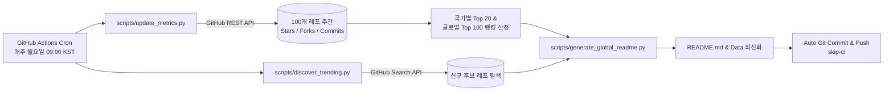

# 🛰️ lazyradar: Global AI Tech Radar & 5-Nation Top 20

> **레이지 시리즈 공식 글로벌 AI 기술 레이더 (Lazy Series Official Tech Radar)**
> 미국·중국·대한민국·유럽·일본 5대 주요국 Top 20 랭킹 분과 및 전 세계 100선 큐레이션 랭킹
> 매주 월요일 09:00 KST, GitHub Actions가 큐레이션된 100개 레포지토리의 Stars/Forks/최근 커밋 지표를 갱신해 순위를 다시 계산하고, Search API로 신규 후보를 제안합니다.

[](https://github.com/daeryundf2-prog/lazyradar/actions/workflows/weekly-sync.yml) 
 
 
 
 


---

## 🌍 5대 주요국별 바로가기

1. [🇺🇸 미국 (United States) Top 20](#cntry-us)
2. [🇨🇳 중국 (China) Top 20](#cntry-cn)
3. [🇰🇷 대한민국 (South Korea) Top 20](#cntry-kr)
4. [🇪🇺 유럽 (Europe) Top 20](#cntry-eu)
5. [🇯🇵 일본 (Japan) Top 20](#cntry-jp)
6. [🏆 전 세계 100선 통합 랭킹 (Global Top 100)](#global-top-100)

---

## 🗺️ 1. 주요 5대국별 Top 20 랭킹 분과

<a id="cntry-us"></a>
### 🇺🇸 미국 (United States) Top 20

| 국가순위 | 통합순위 | 상태 | 도구/프로젝트명 | 개발/조직 | 호환 모델 | Stars | Forks | 활동 점수 | 핵심 설명 및 실무 활용처 | 링크 |
|:---:|:---:|:---:|---|---|---|:---:|:---:|:---:|---|:---:|
| **#01** | `#01` | 🔥 Hot | **openclaw** | openclaw | `Llama 3.3 / Multi-LLM` | ⭐ `390,319` | 🍴 `82,110` | **80.74** | **2026년 급부상한 범용 제너럴리스트 에이전트. 랍스터(Lobster) 아키텍처 기반 자율 태스크 분기**<br>👉 *복잡한 웹 탐색, 코드 수정, 파일 시스템 조작을 단일 목표 지시로 자율 완결할 때* | [GitHub](https://github.com/openclaw/openclaw) |
| **#02** | `#02` | 🔥 Hot | **hermes-agent** | NousResearch | `Hermes 3 / Claude Code / Codex` | ⭐ `248,302` | 🍴 `52,451` | **78.39** | **자율적인 스킬 학습 및 영구 누적을 특징으로 하는 적응형 에이전트 하네스**<br>👉 *세션을 거듭할수록 팀의 특정 도메인 워크플로우에 맞춰 스스로 스킬을 학습하게 할 때* | [GitHub](https://github.com/nousresearch/hermes-agent) |
| **#03** | `#48` | ⚡ Active | **seamless-m4t** | Meta (Facebook Research) | `SeamlessM4T v2` | ⭐ `11,865` | 🍴 `1,179` | **54.89** | **아시아-태평양 수십 개 언어 간의 실시간 음성-음성, 음성-텍스트 다자간 통번역을 지원하는 유니버설 모델**<br>👉 *한-중-일-동남아 크로스보더 비즈니스 미팅 실시간 통역* | [GitHub](https://github.com/facebookresearch/seamless_communication) |
| **#04** | `#05` | 🔥 Hot | **AutoGPT** | Significant-Gravitas | `Multi-LLM` | ⭐ `187,510` | 🍴 `45,998` | **77.06** | **자율 에이전트의 시초이자 현재는 에이전트 빌더, 블록 기반 워크플로우, 벤치마킹을 아우르는 오픈 플랫폼**<br>👉 *다양한 모델의 자율 문제 해결 성공률을 표준 벤치마크로 측정할 때* | [GitHub](https://github.com/Significant-Gravitas/AutoGPT) |
| **#05** | `#07` | 🔥 Hot | **ollama** | Ollama Official | `Llama, Qwen, DeepSeek, Mistral` | ⭐ `181,519` | 🍴 `17,979` | **76.1** | **Mac, Linux, Windows에서 Llama, Qwen, DeepSeek 오픈 모델을 한 줄 명령으로 다운로드 및 실행하는 사실상 글로벌 표준**<br>👉 *로컬 개발 환경에서 GPU 가속을 활용해 오프라인 LLM 서빙 및 로컬 에이전트 백엔드 구축* | [GitHub](https://github.com/ollama/ollama) |
| **#06** | `#09` | 🔥 Hot | **llama.cpp** | Georgi Gerganov | `GGUF Quantized Models` | ⭐ `129,311` | 🍴 `23,634` | **74.86** | **GGUF 양자화 포맷의 원조. 일반 CPU와 통합 메모리 GPU에서 대규모 모델을 돌릴 수 있게 만든 오픈 인프라**<br>👉 *Ollama, Jan, LM Studio 등 전 세계 모든 로컬 AI 앱의 핵심 구동 엔진* | [GitHub](https://github.com/ggerganov/llama.cpp) |
| **#07** | `#10` | 🔥 Hot | **ComfyUI** | comfyanonymous | `Flux, SDXL, Video Diffusion` | ⭐ `134,676` | 🍴 `15,950` | **74.7** | **가장 강력하고 모듈화된 노드 기반 생성형 이미지/비디오 워크플로우 런타임. 에이전트 API 연동 표준**<br>👉 *AI 이미지/영상 생성 파이프라인을 완전 자동화된 백엔드 API로 래핑하여 에이전트와 결합할 때* | [GitHub](https://github.com/comfyanonymous/ComfyUI) |
| **#08** | `#11` | 🔥 Hot | **browser-use** | browser-use | `Claude 3.7 / Multi-LLM` | ⭐ `116,048` | 🍴 `12,774` | **73.86** | **AI가 사람처럼 브라우저를 띄워 클릭, 스크롤, 양식 제출, 로그인, 데이터 수집을 완결하는 웹 에이전트**<br>👉 *API가 없는 웹사이트 예약, 티켓팅, 경쟁사 가격 모니터링, 웹 기반 SaaS 자동 조작* | [GitHub](https://github.com/browser-use/browser-use) |
| **#09** | `#12` | 🔥 Hot | **vllm** | UC Berkeley LMSYS | `All Open-weight LLMs` | ⭐ `92,524` | 🍴 `22,568` | **73.37** | **PagedAttention 기반으로 메모리 낭비를 없애고 처리량을 최대 24배 끌어올린 오픈소스 프로덕션 서빙 엔진**<br>👉 *대규모 사내 서빙 클러스터에서 수백 명의 동시 에이전트 요청을 고속 처리할 때* | [GitHub](https://github.com/vllm-project/vllm) |
| **#10** | `#17` | 🔥 Hot | **mem0** | Mem0 Official | `Multi-LLM / Graph + Vector` | ⭐ `65,885` | 🍴 `7,745` | **70.97** | **사용자의 과거 대화, 선호도, 사실 관계를 지속적으로 갱신하고 인덱싱하는 개인화 메모리 레이어**<br>👉 *모든 에이전트 애플리케이션에 '사용자를 기억하는 영구 기억 장치'를 1줄 코드로 추가할 때* | [GitHub](https://github.com/mem0ai/mem0) |
| **#11** | `#19` | 🔥 Hot | **crewAI** | CrewAI Official | `Multi-LLM / Claude / OpenAI` | ⭐ `58,945` | 🍴 `8,555` | **70.57** | **기획자, 리서처, 작가 등 명확한 직책(Role)과 목표(Goal)를 부여해 가상의 팀을 조직하는 에이전트 프레임워크**<br>👉 *시장 조사 보고서 작성, 뉴스레터 발행 파이프라인을 3~4명의 전문 가상 직원 팀으로 실행* | [GitHub](https://github.com/crewAIInc/crewAI) |
| **#12** | `#20` | 🔥 Hot | **llama_index** | LlamaIndex Official | `Multi-LLM` | ⭐ `52,296` | 🍴 `8,202` | **70.01** | **PDF, 노션, DB 등 방대한 비정형 데이터를 에이전트가 탐색 가능한 인덱스로 연결하는 RAG 표준**<br>👉 *사내 위키, 고객지원 문서, API 문서를 에이전트의 지식 베이스로 공급할 때* | [GitHub](https://github.com/run-llama/llama_index) |
| **#13** | `#21` | 🔥 Hot | **whisper.cpp** | Georgi Gerganov | `OpenAI Whisper` | ⭐ `53,882` | 🍴 `6,192` | **69.9** | **C/C++로 밑바닥부터 재작성된 Whisper 추론 엔진. Apple Silicon Metal 가속으로 실시간 자막 전사 지원**<br>👉 *맥북이나 경량 엣지 디바이스에서 100% 오프라인 고속 음성 인식* | [GitHub](https://github.com/ggerganov/whisper.cpp) |
| **#14** | `#24` | 🔥 Hot | **langgraph** | LangChain Official | `Multi-LLM` | ⭐ `42,178` | 🍴 `7,135` | **68.96** | **상태(State)를 기반으로 순환 루프, 분기 조건, 인간 개입(Human-in-the-loop)을 정의하는 엔터프라이즈 에이전트 표준**<br>👉 *승인 단계가 필요한 결재 시스템, 실패 시 재시도하는 복합 에이전트 워크플로우 개발* | [GitHub](https://github.com/langchain-ai/langgraph) |
| **#15** | `#26` | 🔥 Hot | **sglang** | LMSYS Org | `DeepSeek / Llama / Qwen` | ⭐ `36,377` | 🍴 `9,096` | **68.53** | **복잡한 에이전트 툴 호출과 다단계 추론에서 반복되는 KV 캐시를 Radix 트리로 공유해 레이턴시를 5배 단축**<br>👉 *다단계 검색 및 CoT 추론을 반복하는 복잡한 에이전트의 응답 지연 극소화* | [GitHub](https://github.com/sgl-project/sglang) |
| **#16** | `#27` | 🔥 Hot | **diffusers** | Hugging Face | `PyTorch / Latent Diffusion` | ⭐ `34,590` | 🍴 `7,350` | **68.12** | **Stable Diffusion, Flux, ControlNet 등 최신 확산 모델을 통일된 파이썬 API로 다루는 표준 라이브러리**<br>👉 *에이전트가 백엔드에서 이미지 인페인팅, 스타일 변환, 뎁스 기반 생성을 프로그래밍할 때* | [GitHub](https://github.com/huggingface/diffusers) |
| **#17** | `#28` | 🔥 Hot | **CopilotKit** | CopilotKit Official | `Multi-LLM` | ⭐ `37,498` | 🍴 `4,654` | **68.08** | **기존 웹앱에 사이드바 코파일럿, 텍스트 인라인 편집, 프론트엔드 작업 제어 액션을 5분 만에 붙여주는 툴킷**<br>👉 *사내 대시보드나 SaaS 앱에 사용자의 클릭/입력을 대신하는 인앱 AI 비서를 붙일 때* | [GitHub](https://github.com/CopilotKit/CopilotKit) |
| **#18** | `#29` | 🔥 Hot | **dspy** | Stanford NLP | `Multi-LLM / Open Models` | ⭐ `38,229` | 🍴 `3,351` | **67.87** | **휴리스틱 프롬프트 대신 알고리즘으로 모델 가중치와 프롬프트를 자동 컴파일/최적화하는 스탠퍼드 프레임워크**<br>👉 *RAG 파이프라인의 검색 정밀도와 답변 일관성을 수학적 평가 지표에 맞춰 자동 튜닝할 때* | [GitHub](https://github.com/stanfordnlp/dspy) |
| **#19** | `#36` | 🔥 Hot | **fastmcp** | jlowin (Prefect) | `Claude Desktop / Claude Code / MCP` | ⭐ `27,880` | 🍴 `2,395` | **66.21** | **FastAPI 스타일의 데코레이터 문법으로 고성능 Model Context Protocol(MCP) 서버를 10줄 만에 빌드**<br>👉 *사내 파이썬 함수와 데이터베이스를 Claude의 외부 도구로 즉시 등록할 때* | [GitHub](https://github.com/jlowin/fastmcp) |
| **#20** | `#50` | 💤 Stable | **aider** | Paul Gauthier (Aider) | `Multi-LLM` | ⭐ `49,130` | 🍴 `4,985` | **54.31** | **터미널에서 Git과 완벽 연동되어 자동 커밋 메시지, diff 패치, 파일 맵을 관리하는 1위 코딩 도구**<br>👉 *로컬 터미널에서 기존 Git 레포지토리를 직접 보며 페어 프로그래밍으로 기능 추가 및 디버깅* | [GitHub](https://github.com/Aider-AI/aider) |

<a id="cntry-cn"></a>
### 🇨🇳 중국 (China) Top 20

| 국가순위 | 통합순위 | 상태 | 도구/프로젝트명 | 개발/조직 | 호환 모델 | Stars | Forks | 활동 점수 | 핵심 설명 및 실무 활용처 | 링크 |
|:---:|:---:|:---:|---|---|---|:---:|:---:|:---:|---|:---:|
| **#01** | `#04` | 🔥 Hot | **deepseek-harness** | deepseek-ai | `DeepSeek` | ⭐ `234,163` | 🍴 `28,132` | **77.59** | **Cordis 설계를 도입하여 모델, 툴, 세션, 루프 전부를 플러그인으로 갈아끼우는 프레임워크 독립형 하네스**<br>👉 *DeepSeek 기반의 경량·모듈형 자율 코딩 에이전트 환경 구축* | [GitHub](https://github.com/deepseek-ai/deepseek-harness) |
| **#02** | `#08` | 🔥 Hot | **dify** | LangGenius | `Multi-LLM / Plugin Architecture` | ⭐ `156,969` | 🍴 `24,740` | **75.74** | **비주얼 오케스트레이션, RAG 파이프라인, 에이전트 워크플로우를 완성형 웹 앱으로 즉시 배포하는 글로벌 리딩 플랫폼**<br>👉 *개발팀과 비개발팀이 협업하여 실서비스용 엔터프라이즈 AI 앱을 노코드로 운영할 때* | [GitHub](https://github.com/langgenius/dify) |
| **#03** | `#13` | 🔥 Hot | **ragflow** | Infiniflow | `Deep Document Understanding` | ⭐ `91,223` | 🍴 `10,812` | **72.67** | **문서의 템플릿과 레이아웃을 깊이 이해하여 표와 단락이 엉키지 않도록 청킹하는 차세대 오픈소스 RAG**<br>👉 *복잡한 서식의 매뉴얼과 정관에서 단 하나의 오류도 없이 정확한 조항을 검색할 때* | [GitHub](https://github.com/infiniflow/ragflow) |
| **#04** | `#14` | 🔥 Hot | **PaddleOCR** | Baidu Official | `PaddlePaddle Engine` | ⭐ `90,085` | 🍴 `11,398` | **72.66** | **80개 이상 언어를 지원하는 초경량, 고정밀 산업용 OCR. 다단 표 및 영수증 텍스트 추출의 글로벌 최강자**<br>👉 *스캔 공문서, 영수증, 송장 자동 입력 파이프라인의 핵심 전처리 엔진* | [GitHub](https://github.com/PaddlePaddle/PaddleOCR) |
| **#05** | `#15` | 🔥 Hot | **MinerU** | OpenDataLab | `All LLMs / RAG Platforms` | ⭐ `80,530` | 🍴 `6,722` | **71.71** | **복잡한 비정형 PDF, 오피스 문서, 학술 논문을 마크다운/JSON으로 완벽 추출하여 RAG 병목을 해결한 1위 도구**<br>👉 *다단 레이아웃, 복합 표, 수식이 엉킨 논문/보고서를 LLM이 읽기 완벽한 포맷으로 변환* | [GitHub](https://github.com/opendatalab/MinerU) |
| **#06** | `#30` | 🔥 Hot | **FastGPT** | labring | `Multi-LLM` | ⭐ `29,726` | 🍴 `7,322` | **67.46** | **데이터 전처리, 벡터 검색, 재순위화(Reranking)에 특화된 완성형 지식 베이스 질의응답 플랫폼**<br>👉 *사내 CS 문의 응대 및 방대한 제품 매뉴얼 기반 고정밀 자동 답변봇* | [GitHub](https://github.com/labring/FastGPT) |
| **#07** | `#32` | 🔥 Hot | **fish-speech** | Fish Audio | `Zero-shot TTS` | ⭐ `32,812` | 🍴 `2,832` | **67.06** | **영어, 중국어, 일본어, 한국어를 완벽 지원하는 고품질 제로샷 텍스트-음성 변환 오픈 엔진**<br>👉 *글로벌 타깃 버추얼 휴먼 및 게임 캐릭터의 고화질 음성 더빙* | [GitHub](https://github.com/fishaudio/fish-speech) |
| **#08** | `#34` | 🔥 Hot | **Qwen-Code** | Alibaba Cloud QwenLM | `Qwen 2.5 Coder` | ⭐ `28,085` | 🍴 `3,093` | **66.47** | **터미널에서 직접 실행되는 오픈소스 코딩 에이전트. Qwen-2.5-Coder의 최적화된 토크나이저와 도구 연동**<br>👉 *오픈 모델 기반의 독립된 사내 전용 코딩 비서 환경 배포* | [GitHub](https://github.com/QwenLM/Qwen-Code) |
| **#09** | `#37` | 🔥 Hot | **DB-GPT** | eosphoros-ai | `Multi-agent DB` | ⭐ `20,036` | 🍴 `2,941` | **64.96** | **데이터와 메타데이터의 외부 유출 없이 로컬 DB에 직접 쿼리를 날리고 시각화하는 프라이빗 데이터 에이전트**<br>👉 *사내 RDBMS, NoSQL, 웨어하우스에 대한 안전한 자연어 데이터 분석 및 보고서 작성* | [GitHub](https://github.com/eosphoros-ai/DB-GPT) |
| **#10** | `#38` | 🔥 Hot | **ktransformers** | Tsinghua & KVCache AI | `DeepSeek MoE` | ⭐ `19,535` | 🍴 `1,576` | **64.3** | **일반 데스크톱 GPU(예: RTX 4090) 1장으로 DeepSeek 671B MoE 모델을 실행시키는 혁신적인 CPU-GPU 오프로딩**<br>👉 *수천만 원대 H100 서버 없이 일반 데스크톱에서 최고 스펙의 DeepSeek 모델을 로컬 구동* | [GitHub](https://github.com/kvcache-ai/ktransformers) |
| **#11** | `#41` | 🔥 Hot | **SenseVoice** | Alibaba FunAudioLLM | `Multi-lingual Speech` | ⭐ `9,363` | 🍴 `828` | **60.55** | **Whisper 대비 5배 빠르고 감정, 음악, 웃음소리까지 감지하는 음성 인식 및 오디오 이해 모델**<br>👉 *고객센터 통화 감정 분석 및 고속 실시간 회의록 전사* | [GitHub](https://github.com/FunAudioLLM/SenseVoice) |
| **#12** | `#42` | 💤 Stable | **DeepSeek-V3** | deepseek-ai | `MoE Architecture` | ⭐ `104,480` | 🍴 `16,733` | **58.64** | **671B 총 파라미터 중 37B만 활성화하는 초고효율 MoE 아키텍처. 상용 최상위 모델과 대등한 벤치마크 기록**<br>👉 *사내 프라이빗 대규모 LLM 클러스터의 메인 범용 추론 백본* | [GitHub](https://github.com/deepseek-ai/DeepSeek-V3) |
| **#13** | `#45` | 💤 Stable | **DeepSeek-R1** | deepseek-ai | `DeepSeek / Open-weight Frontier` | ⭐ `91,974` | 🍴 `11,679` | **57.77** | **글로벌 AI 씬을 뒤흔든 오픈 가중치 최고봉 추론 모델. 강화학습을 통해 OpenAI o1 수준의 수학/코딩 추론 달성**<br>👉 *복잡한 알고리즘 설계, 정밀 코드 디버깅 및 고난도 수학적 논리 전개* | [GitHub](https://github.com/deepseek-ai/DeepSeek-R1) |
| **#14** | `#51` | 💤 Stable | **ChatTTS** | 2noise | `Speech Generation` | ⭐ `39,864` | 🍴 `4,260` | **53.26** | **인터랙티브 대화에 특화된 혁신적 음성 합성 모델. 말하는 도중 자연스러운 웃음, 호흡, 억양 표현**<br>👉 *대화형 AI 보이스 에이전트 및 오디오북, 팟캐스트 내레이션 제작* | [GitHub](https://github.com/2noise/ChatTTS) |
| **#15** | `#52` | 💤 Stable | **CosyVoice** | Alibaba NLP | `Multi-lingual Speech` | ⭐ `23,745` | 🍴 `2,701` | **50.62** | **3초 오디오만으로 화자의 음색, 감정, 어투를 그대로 복제하고 다국어로 교차 발화하는 음성 모델**<br>👉 *유튜브 영상의 다국어 더빙 시 원작자 본인의 목소리로 외국어 대사 생성* | [GitHub](https://github.com/FunAudioLLM/CosyVoice) |
| **#16** | `#56` | 💤 Stable | **Qwen-Agent** | Alibaba Cloud QwenLM | `Qwen 2.5 / Qwen 3` | ⭐ `17,119` | 🍴 `1,731` | **48.81** | **8k부터 1M 컨텍스트까지 처리하는 알리바바 공식 에이전트. 펑션 콜링, 코드 인터프리터, 다중 툴 플래닝**<br>👉 *대규모 책 한 권이나 초대형 소스코드 레포를 읽고 분석하는 문서 에이전트* | [GitHub](https://github.com/QwenLM/Qwen-Agent) |
| **#17** | `#57` | ✨ Fresh | **XAgent** | OpenBMB | `Autonomous LLM` | ⭐ `8,550` | 🍴 `905` | **48.23** | **인간의 개입 없이 복잡한 목표를 하위 과제로 쪼개고 외부 도구를 탐색하며 실행하는 자율 문제 해결 시스템**<br>👉 *복잡한 데이터 분석, 코드 작성, 인터넷 조사를 사람 없이 밤새 자율 실행시킬 때* | [GitHub](https://github.com/OpenBMB/XAgent) |
| **#18** | `#59` | ✨ Fresh | **GLM-4** | Zhipu AI (THUDM) | `1M Context / All-Tools` | ⭐ `7,071` | 🍴 `616` | **47.07** | **칭화대 계열 Zhipu AI의 플래그십. 1M 장문 처리, 복합 도구 호출, 고정밀 웹 브라우징 능력 제공**<br>👉 *긴 계약서 검토 및 대규모 데이터셋 크로스체크 에이전트* | [GitHub](https://github.com/THUDM/GLM-4) |
| **#19** | `#61` | 💤 Stable | **InternVL** | OpenGVLab | `Vision-Language Model` | ⭐ `10,163` | 🍴 `789` | **45.86** | **GPT-4V 수준의 시각 이해 벤치마크를 기록한 오픈소스 멀티모달. 고해상도 이미지 및 복합 도표 판독 특화**<br>👉 *공학 도면 판독, 차트 분석, 스마트폰 UI 스크린샷 이해 에이전트* | [GitHub](https://github.com/OpenGVLab/InternVL) |
| **#20** | `#62` | 💤 Stable | **MindSearch** | Shanghai AI Laboratory | `InternLM 2.5 / Multi-Agent` | ⭐ `6,933` | 🍴 `692` | **44.09** | **인간 인지 과정을 모방해 다단계 병렬 검색과 지식 그래프를 구성하는 심층 연구 엔진 (Perplexity 대안)**<br>👉 *복잡한 학술, 산업 리서치 주제에 대해 100개 이상의 웹페이지를 교차 검증해 레포트 작성* | [GitHub](https://github.com/InternLM/MindSearch) |

<a id="cntry-kr"></a>
### 🇰🇷 대한민국 (South Korea) Top 20

| 국가순위 | 통합순위 | 상태 | 도구/프로젝트명 | 개발/조직 | 호환 모델 | Stars | Forks | 활동 점수 | 핵심 설명 및 실무 활용처 | 링크 |
|:---:|:---:|:---:|---|---|---|:---:|:---:|:---:|---|:---:|
| **#01** | `#43` | 🔥 Hot | **im-not-ai** | epoko77-ai | `Claude Skill / Prompt Engine` | ⭐ `5,686` | 🍴 `619` | **58.13** | **AI가 쓴 한글 텍스트의 번역투, 기계적 병렬, 71대 AI 티를 탐지해 자연스러운 한국어로 정밀 재작성**<br>👉 *생성형 AI로 작성한 보고서, 블로그, 제안서의 번역투와 기계적인 문체를 인간 문체로 탈바꿈* | [GitHub](https://github.com/epoko77-ai/im-not-ai) |
| **#02** | `#58` | 🔥 Hot | **Kiwi** | bab2min (이민철) | `C++ Kiwi Engine` | ⭐ `782` | 🍴 `77` | **47.71** | **C++로 작성된 초고속 고정밀 한국어 형태소 분석기. 띄어쓰기 오류가 있는 텍스트도 강력하게 교정 분석**<br>👉 *초당 수만 건의 비정형 텍스트 색인 전처리, 한국어 검색엔진 형태소 인덱싱* | [GitHub](https://github.com/bab2min/Kiwi) |
| **#03** | `#64` | 💤 Stable | **donut** | clovaai (Naver Clova) | `Donut Architecture` | ⭐ `6,927` | 🍴 `564` | **43.91** | **네이버 클로바가 공개한 OCR 엔진 없는 혁신적 엔드투엔드 문서 이해 모델. 이미지에서 JSON으로 직결 변환**<br>👉 *영수증, 송장, 명함, 양식 문서를 OCR 단계 없이 단번에 정형 데이터로 추출* | [GitHub](https://github.com/clovaai/donut) |
| **#04** | `#66` | 💤 Stable | **deep-text-recognition** | clovaai (Naver Clova) | `PyTorch / Clova OCR` | ⭐ `3,944` | 🍴 `1,132` | **42.07** | **네이버 클로바 연구팀이 구축한 텍스트 인식 벤치마크 및 4단계 모듈형 고정밀 OCR 프레임워크**<br>👉 *간판, 스캔 문서, 번호판 등 다양한 환경의 비정형 문자 추출 모델 훈련 및 배포* | [GitHub](https://github.com/clovaai/deep-text-recognition-benchmark) |
| **#05** | `#71` | 💤 Stable | **langchain-kr** | teddylee777 (테디노트) | `LangChain / Multi-LLM` | ⭐ `2,056` | 🍴 `736` | **38.86** | **한국 AI 커뮤니티 최대 규모의 LangChain 실무 쿡북. 실무 RAG, 프롬프트 엔지니어링, 에이전트 튜토리얼 총망라**<br>👉 *기업 내 한국어 RAG 파이프라인 및 멀티 에이전트 워크플로우를 신속하게 프로토타이핑할 때* | [GitHub](https://github.com/teddylee777/langchain-kr) |
| **#06** | `#72` | ✨ Fresh | **fluent-korean** | snflkd | `Claude Code / Cursor / Codex` | ⭐ `1,333` | 🍴 `92` | **38.18** | **Claude Code 등 글로벌 CLI 코딩 에이전트가 번역투 없이 명확하고 유창한 한국어를 구사하도록 제어하는 플러그인**<br>👉 *코딩 에이전트 작업 시 영한 혼용이나 어색한 번역투 답변을 근절하고 자연스러운 개발 피드백 획득* | [GitHub](https://github.com/snflkd/fluent-korean) |
| **#07** | `#74` | 💤 Stable | **KoAlpaca** | Beomi (이준범) | `Llama / Polyglot-Ko` | ⭐ `1,572` | 🍴 `224` | **36.67** | **한국어 인스트럭션 데이터셋 구축 및 라마/폴리글롯 파인튜닝의 시초가 된 대표 오픈소스**<br>👉 *사내 한국어 비즈니스 지시 수행 모델 파인튜닝 데이터셋 및 학습 파이프라인 구축* | [GitHub](https://github.com/Beomi/KoAlpaca) |
| **#08** | `#75` | 💤 Stable | **KoBERT** | SKTBrain (SK Telecom) | `BERT Architecture` | ⭐ `1,420` | 🍴 `376` | **36.67** | **SK텔레콤이 5400만 개 이상의 한국어 문장으로 학습해 공개한 한국어 대표 사전학습 언어모델**<br>👉 *고객 상담 분류, 감성 분석, 질문 유사도 판정 등 전통적 NLP 태스크 백본* | [GitHub](https://github.com/SKTBrain/KoBERT) |
| **-** | `-` | 📦 Archived | **pororo** | kakaobrain (Kakao Brain) | `PyTorch / Transformer` | ⭐ `1,304` | 🍴 `216` | **35.82** | **카카오브레인이 공개한 30가지 이상의 한국어 NLP 태스크(개체명인식, 질의응답, 요약 등) 통합 프레임워크**<br>👉 *단 3줄의 코드로 기사 요약, 문맥 유사도, 기계 독해 파이프라인 즉시 구성* | [GitHub](https://github.com/kakaobrain/pororo) |
| **#10** | `#80` | 💤 Stable | **soynlp** | lovit (김현중) | `Unsupervised Korean NLP` | ⭐ `993` | 🍴 `183` | **34.49** | **사전 없이도 텍스트 데이터의 응집도(Cohesion)와 분기군(Branching Entropy)으로 단어를 자동 추출하는 비지도 토크나이저**<br>👉 *신조어나 전문 용어가 가득한 고객 리뷰, 포럼 데이터에서 미등록 어휘를 자동 추출할 때* | [GitHub](https://github.com/lovit/soynlp) |
| **#11** | `#82` | 💤 Stable | **kogpt** | kakaobrain (Kakao Brain) | `GPT-3 Architecture (6B)` | ⭐ `1,011` | 🍴 `135` | **34.31** | **카카오브레인이 2000억 토큰 한국어 데이터를 학습해 오픈소스로 공개한 60억 파라미터 한국어 LLM**<br>👉 *한국어 대화 생성, 질의응답 및 프라이빗 로컬 생성 모델 구축* | [GitHub](https://github.com/kakaobrain/kogpt) |
| **#12** | `#84` | 💤 Stable | **Korpora** | ko-nlp (박은정 등) | `All Korean NLP Stacks` | ⭐ `758` | 🍴 `78` | **32.58** | **네이버 영화 리뷰, 국립국어원 등 대표적인 오픈 한국어 말뭉치를 한 줄 파이썬 코드로 다운로드/정제하는 툴킷**<br>👉 *사내 한국어 NLP 모델 훈련을 위한 벤치마크 및 공개 말뭉치 신속 파이프라인 구성* | [GitHub](https://github.com/ko-nlp/Korpora) |
| **#13** | `#85` | 💤 Stable | **KoELECTRA** | monologg (박장원) | `ELECTRA Architecture` | ⭐ `641` | 🍴 `135` | **32.33** | **대규모 한국어 텍스트로 사전학습된 고성능 ELECTRA 모델. 한국어 감정분석, 문서분류, 질의응답 최고 벤치마크**<br>👉 *사내 고객 상담 텍스트 분류, 악성 리뷰 필터링, RAG 리랭커로 활용* | [GitHub](https://github.com/monologg/KoELECTRA) |
| **#14** | `#86` | 💤 Stable | **KoGPT2** | SKT-AI (SK Telecom) | `GPT-2 Architecture` | ⭐ `559` | 🍴 `102` | **31.49** | **SK텔레콤이 공개한 한국어 범용 문장 생성 모델. 소설 이어쓰기, 챗봇 대화 생성용 기초 모델**<br>👉 *챗봇 프로토타입 제작 및 한국어 텍스트 자동 완성* | [GitHub](https://github.com/SKT-AI/KoGPT2) |
| **#15** | `#87` | 💤 Stable | **KULLM** | nlpai-lab (고려대학교 NLP연구실) | `GPT-4 Distillation / Polyglot` | ⭐ `589` | 🍴 `69` | **31.38** | **고려대학교 NLP 연구실과 HICA가 공동 제작한 한국어 인스트럭션 파인튜닝 모델 시리즈 (구름)**<br>👉 *학술 연구 및 한국어 상식 추론, 대화형 도메인 모델 프로토타이핑* | [GitHub](https://github.com/nlpai-lab/KULLM) |
| **#16** | `#89` | 💤 Stable | **KoBART** | SKT-AI | `BART Architecture` | ⭐ `470` | 🍴 `94` | **30.67** | **SK텔레콤이 공개한 한국어 사전학습 BART 모델. 한국어 장문 기사 요약 및 문장 생성 표준**<br>👉 *뉴스 기사 자동 3줄 요약, 사내 회의록 요약, 한국어 챗봇 생성 백본* | [GitHub](https://github.com/SKT-AI/KoBART) |
| **#17** | `#90` | 💤 Stable | **PyKoSpacing** | haven-jeon (전희원) | `Deep Learning / Python` | ⭐ `436` | 🍴 `115` | **30.52** | **대규모 말뭉치 기반 딥러닝으로 띄어쓰기가 누락되거나 잘못된 문장을 정확하게 교정하는 도구**<br>👉 *음성인식(STT) 텍스트 전처리 및 모바일 메신저 대화 띄어쓰기 자동 보정* | [GitHub](https://github.com/haven-jeon/PyKoSpacing) |
| **#18** | `#91` | 💤 Stable | **KcBERT** | Beomi (이준범) | `BERT Architecture` | ⭐ `498` | 🍴 `46` | **30.3** | **정제되지 않은 포털 뉴스 댓글 수천만 건으로 사전학습된 모델. 구어체, 오탈자, 비속어 필터링에 탁월**<br>👉 *SNS 댓글 모니터링, 악플 및 혐오 표현 자동 탐지 필터* | [GitHub](https://github.com/Beomi/KcBERT) |
| **#19** | `#92` | 💤 Stable | **cord** | clovaai (Naver Clova) | `Document AI` | ⭐ `489` | 🍴 `44` | **30.18** | **네이버 클로바가 공개한 영수증/송장 문서 정보 추출을 위한 통합 벤치마크 데이터셋**<br>👉 *경비 지출 관리 자동화 및 영수증 품목/금액 자동 파싱 엔진 개발* | [GitHub](https://github.com/clovaai/cord) |
| **#20** | `#93` | 💤 Stable | **polyglot** | EleutherAI & 튜닙 | `Polyglot-Ko 1.3B ~ 12.8B` | ⭐ `488` | 🍴 `42` | **30.13** | **한국어 씬에서 가장 널리 쓰이는 비영어권 오픈 파운데이션 모델. 한국어 토크나이저 최적화**<br>👉 *로컬 프라이빗 한국어 AI 비서 및 온프레미스 도메인 특화 모델 기반* | [GitHub](https://github.com/EleutherAI/polyglot) |

<a id="cntry-eu"></a>
### 🇪🇺 유럽 (Europe - 영국/프랑스/독일 등) Top 20

| 국가순위 | 통합순위 | 상태 | 도구/프로젝트명 | 개발/조직 | 호환 모델 | Stars | Forks | 활동 점수 | 핵심 설명 및 실무 활용처 | 링크 |
|:---:|:---:|:---:|---|---|---|:---:|:---:|:---:|---|:---:|
| **#01** | `#06` | 🔥 Hot | **transformers** | Hugging Face (France/US) | `Every Open Model` | ⭐ `166,563` | 🍴 `34,663` | **76.3** | **현대 AI 오픈소스 생태계의 기틀. 전 세계 수십만 개의 사전학습 모델을 다운로드하고 추론하는 표준 라이브러리**<br>👉 *새로 발표된 전 세계 최신 모델을 단 몇 줄의 파이썬 코드로 불러와 테스트할 때* | [GitHub](https://github.com/huggingface/transformers) |
| **#02** | `#16` | 🔥 Hot | **unsloth** | Unsloth AI (UK - Daniel Han) | `Llama, Qwen, DeepSeek, Mistral` | ⭐ `76,628` | 🍴 `7,014` | **71.54** | **파이토치 연산을 수작업으로 최적화하여 LLM 파인튜닝 속도를 5배 빠르게, VRAM 사용량을 80% 줄인 영국 명품 툴**<br>👉 *일반 단일 GPU에서 70B 모델을 수 시간 만에 LoRA 파인튜닝할 때* | [GitHub](https://github.com/unslothai/unsloth) |
| **#03** | `#03` | 🔥 Hot | **n8n** | n8n.io | `Multi-LLM / LangChain 연동` | ⭐ `205,766` | 🍴 `60,861` | **77.7** | **수백 개의 SaaS와 데이터베이스를 AI 에이전트 노드로 연결하는 오픈소스 비주얼 워크플로우 플랫폼**<br>👉 *슬랙, 노션, 세일즈포스, 이메일 간 복잡한 비즈니스 로직에 AI 판단 노드를 얹어 자동화할 때* | [GitHub](https://github.com/n8n-io/n8n) |
| **#03** | `#18` | 🔥 Hot | **AnythingLLM** | Mintplex Labs | `Multi-LLM / Multi-Vector` | ⭐ `66,365` | 🍴 `7,389` | **70.96** | **GDPR 및 완전 프라이버시를 보장하는 데스크톱/서버 AI 앱. 문서 드래그 앤 드롭 RAG, 다중 사용자 권한 관리**<br>👉 *외부 클라우드 전송이 엄격히 금지된 법무법인, 회계법인의 사내 폐쇄망 AI 포털* | [GitHub](https://github.com/Mintplex-Labs/anything-llm) |
| **#04** | `#22` | 🔥 Hot | **ai-job-search** | Mads Lorentzen (Denmark) | `Claude Code / Codex / Gemini CLI` | ⭐ `43,725` | 🍴 `15,040` | **69.76** | **덴마크 개발자가 제작한 오픈소스. 채용공고 스크랩부터 이력서 맞춤 작성, 모의면접까지 자율 완결**<br>👉 *구직자가 수십 개 타깃 기업에 맞춘 고품질 영문 커버레터와 CV를 자동 생성할 때* | [GitHub](https://github.com/MadsLorentzen/ai-job-search) |
| **#05** | `#23` | 🔥 Hot | **LocalAI** | mudler (Italy) | `Drop-in OpenAI Replacement` | ⭐ `49,240` | 🍴 `4,465` | **69.22** | **인터넷 없이 로컬 하드웨어에서 구동되는 오픈AI 규격 완벽 호환 REST API 서버 (텍스트, 음성, 이미지)**<br>👉 *기존 상용 OpenAI API 코드를 단 한 줄도 수정하지 않고 사내 로컬 환경으로 교체할 때* | [GitHub](https://github.com/mudler/LocalAI) |
| **#06** | `#25` | 🔥 Hot | **mindsdb** | MindsDB (UK/US) | `SQL-to-Model` | ⭐ `39,762` | 🍴 `6,245` | **68.59** | **SQL 쿼리문 안에서 직접 AI 모델을 호출하고 실시간 예측 및 텍스트 분석을 수행하는 미들웨어**<br>👉 *기존 DB 엔지니어가 파이썬 코드 없이 익숙한 SQL만으로 사내 데이터에 AI를 적용할 때* | [GitHub](https://github.com/mindsdb/mindsdb) |
| **#07** | `#31` | 🔥 Hot | **qdrant** | Qdrant (Germany - Berlin) | `Rust High Performance` | ⭐ `34,759` | 🍴 `2,691` | **67.27** | **Rust로 작성된 초고성능 벡터 검색 엔진. 풍부한 페이로드 필터링과 지연 없는 시맨틱 검색 지원**<br>👉 *수백만 건의 문서에서 태그, 날짜, 카테고리 필터와 벡터 유사도 검색을 동시 초고속 처리할 때* | [GitHub](https://github.com/qdrant/qdrant) |
| **#08** | `#33` | 🔥 Hot | **smolagents** | Hugging Face (France/US) | `Any LLM / Open Weights` | ⭐ `29,458` | 🍴 `2,987` | **66.64** | **복잡한 프레임워크 대신 에이전트의 모든 판단과 도구 호출을 파이썬 코드로 표현하는 미니멀리즘 에이전트**<br>👉 *수천 줄의 복잡한 추상화 없이 몇 줄의 순수 파이썬 코드로 가볍고 강력한 에이전트를 조립할 때* | [GitHub](https://github.com/huggingface/smolagents) |
| **#09** | `#35` | 🔥 Hot | **haystack** | deepset (Germany - Berlin) | `Multi-LLM` | ⭐ `26,584` | 🍴 `3,174` | **66.25** | **독일 특유의 견고한 엔지니어링으로 모듈화된 엔터프라이즈 RAG 및 에이전트 파이프라인 프레임워크**<br>👉 *기업 보안과 유지보수성이 핵심인 엔터프라이즈 시맨틱 검색 및 문서 질의응답 시스템 구축* | [GitHub](https://github.com/deepset-ai/haystack) |
| **#10** | `#39` | 🔥 Hot | **weaviate** | Weaviate (Netherlands - Amsterdam) | `Go / Cloud Native` | ⭐ `16,839` | 🍴 `1,407` | **63.56** | **네덜란드 암스테르담에서 탄생한 클라우드 네이티브 벡터 데이터베이스. 멀티모달 검색 및 하이브리드 검색 특화**<br>👉 *이미지와 텍스트가 섞인 멀티모달 이커머스 상품 시맨틱 검색 엔진* | [GitHub](https://github.com/weaviate/weaviate) |
| **#11** | `#40` | 🔥 Hot | **SubtitleEdit** | Nikolaj Lynge Olsson (Denmark) | `Local Whisper Integration` | ⭐ `14,305` | 🍴 `1,310` | **62.79** | **덴마크에서 개발되어 전 세계 영상 전문가들이 사용하는 오픈소스 자막 편집기. 로컬 AI 모델 내장으로 오프라인 전사**<br>👉 *방송국, 영상 제작사의 대용량 영상 로컬 자막 제작 및 다국어 싱크 수정* | [GitHub](https://github.com/SubtitleEdit/subtitleedit) |
| **#12** | `#44` | 🔥 Hot | **maka** | Apache Maka Project (EU) | `Auditable Local Runs` | ⭐ `5,617` | 🍴 `519` | **57.93** | **에이전트가 내린 모든 툴 호출과 로컬 bash 명령어를 불변(Immutable) 원장에 기록해 법적 책임을 증명하는 엔진**<br>👉 *자율 에이전트의 오작동 및 보안 사고 발생 시 원인 규명과 법적 감사 증빙* | [GitHub](https://github.com/apache/maka) |
| **#13** | `#49` | ⚡ Active | **moshi** | Kyutai Labs (France - Paris) | `Helium 7B / Mimi Audio` | ⭐ `11,138` | 🍴 `1,034` | **54.5** | **파리 비영리 연구소 Kyutai가 공개한 오픈소스 음성 대화 AI. STT/TTS 없이 200ms 지연으로 사람과 실시간 수다**<br>👉 *중간 텍스트 변환 병목 없이 사람과 즉각 호흡을 주고받는 차세대 실시간 대화봇* | [GitHub](https://github.com/kyutai-labs/moshi) |
| **#14** | `#55` | 🔥 Hot | **Mistral-Large** | Mistral AI (France) | `Mistral Architecture` | ⭐ `946` | 🍴 `178` | **49.26** | **프랑스 AI 대표주자 Mistral의 플래그십. 다국어(불어, 독어, 스페인어, 영어)와 복잡한 추론에서 최고 수준 성능**<br>👉 *EU AI Act 및 데이터 주권(Sovereign AI) 규제를 준수하는 기업용 대규모 언어 모델* | [GitHub](https://github.com/mistralai/mistral-common) |
| **-** | `-` | 📦 Archived | **text-generation-inference** | Hugging Face (TGI) | `Tensor Parallelism` | ⭐ `10,884` | 🍴 `1,291` | **46.59** | **Hugging Face의 엔터프라이즈급 LLM 서빙 엔진. 텐서 병렬화, 토큰 스트리밍, 플래시 어텐션 지원**<br>👉 *Kubernetes 환경에서 오픈 모델을 대규모 서비스 엔드포인트로 운영할 때* | [GitHub](https://github.com/huggingface/text-generation-inference) |
| **#16** | `#63` | ⚡ Active | **hibiki** | Kyutai Labs (France - Paris) | `Moshi Lineage` | ⭐ `1,521` | 🍴 `119` | **43.97** | **말하는 도중 실시간으로 다른 언어로 음성을 바꿔서 뱉어내는 엔드투엔드 동시통역 음성 모델**<br>👉 *국제 컨퍼런스 실시간 음성 통역 및 다국어 실시간 화상 회의* | [GitHub](https://github.com/kyutai-labs/hibiki) |
| **-** | `-` | 📦 Archived | **rhasspy** | Michael Hansen (EU Open Source) | `Offline Voice Stack` | ⭐ `2,746` | 🍴 `208` | **39.02** | **클라우드 전송 없는 완전 오프라인 프라이빗 음성 비서 툴킷. 홈 오토메이션(Home Assistant) 완벽 연동**<br>👉 *스마트홈 기기를 외부 서버 도청 걱정 없이 음성으로 제어할 때* | [GitHub](https://github.com/rhasspy/rhasspy) |
| **-** | `-` | 📦 Archived | **FARM** | deepset (Germany) | `Transformer Transfer Learning` | ⭐ `1,754` | 🍴 `242` | **37.21** | **독일 deepset이 개발한 산업용 트랜스포머 전이학습 및 도메인 모델 파인튜닝 프레임워크**<br>👉 *사내 도메인 특화 질문응답 및 텍스트 분류 모델 최적화 배포* | [GitHub](https://github.com/deepset-ai/FARM) |
| **#19** | `#96` | 💤 Stable | **mistral-eval** | Mistral AI (France) | `Mistral Models` | ⭐ `92` | 🍴 `15` | **21.99** | **유럽 각국 언어(프랑스어, 독일어, 이탈리아어 등)에서의 논리적 일관성과 규제 준수성을 측정하는 벤치마크**<br>👉 *유럽 다국어 비즈니스 서비스 런칭 시 각 언어별 모델 응답 품질 보증* | [GitHub](https://github.com/mistralai/mistral-evals) |
| **#20** | `#98` | 💤 Stable | **luminous** | Aleph Alpha (Germany - Heidelberg) | `Multimodal / Enterprise` | ⭐ `0` | 🍴 `0` | **0.0** | **독일 하이델베르크의 Aleph Alpha가 개발한 설명 가능성(Explainability) 중심의 유럽형 파운데이션 모델**<br>👉 *답변의 근거가 되는 원본 문서의 위치를 정확히 역추적해야 하는 유럽 공공/의료 시스템* | [GitHub](https://github.com/Aleph-Alpha/luminous) |

<a id="cntry-jp"></a>
### 🇯🇵 일본 (Japan) Top 20

| 국가순위 | 통합순위 | 상태 | 도구/프로젝트명 | 개발/조직 | 호환 모델 | Stars | Forks | 활동 점수 | 핵심 설명 및 실무 활용처 | 링크 |
|:---:|:---:|:---:|---|---|---|:---:|:---:|:---:|---|:---:|
| **#01** | `#46` | 🔥 Hot | **koharu** | koharu-rs | `Rust / Multimodal Vision` | ⭐ `5,632` | 🍴 `393` | **57.7** | **Rust로 작성된 초고속 오픈소스 AI 만화 번역기. 텍스트 버블 탐지, OCR, 문맥 번역 및 인페인팅**<br>👉 *일본 만화 이미지의 일본어 대사를 인식하고 자연스러운 번역 텍스트로 자동 대치* | [GitHub](https://github.com/koharu-rs/koharu) |
| **#02** | `#47` | 🔥 Hot | **voicevox** | Hiroshiba (Japan) | `Japanese Neural TTS` | ⭐ `3,245` | 🍴 `374` | **55.26** | **일본 버추얼 유튜버 및 크리에이터 생태계의 절대적 1위 무료 음성 합성 소프트웨어 (즌다몬 등)**<br>👉 *일본어 해설 영상, 서브컬처 게임, 버추얼 캐릭터 대사 자동 생성* | [GitHub](https://github.com/VOICEVOX/voicevox) |
| **#04** | `#53` | 🔥 Hot | **voicevox_core** | VOICEVOX Project | `C++ / Python / Rust Binding` | ⭐ `1,133` | 🍴 `160` | **49.95** | **VOICEVOX의 고속 음성 합성 백엔드 C++ 코어. 파이썬과 러스트에서 경량 임베디드로 음성 출력**<br>👉 *코딩 에이전트가 작업 완료 시 귀여운 일본어 보이스로 알림을 주도록 연동* | [GitHub](https://github.com/VOICEVOX/voicevox_core) |
| **#05** | `#54` | 🔥 Hot | **awesome-japanese-llm** | llm-jp (National Institute of Informatics) | `Japanese Academic LLMs` | ⭐ `1,432` | 🍴 `47` | **49.9** | **일본 국립정보학연구소(NII) 주도로 일본 내 공개된 모든 파운데이션 모델, 데이터셋을 집대성한 공식 허브**<br>👉 *일본 오픈소스 언어모델 현황 및 벤치마크 점수 일괄 비교* | [GitHub](https://github.com/llm-jp/awesome-japanese-llm) |
| **#06** | `#65` | ⚡ Active | **natural-japanese** | coji | `Claude Code / Agent Skill` | ⭐ `1,444` | 🍴 `36` | **42.71** | **AI가 생성한 일본어 텍스트를 읽기 쉽고 격식 있는 비즈니스 일본어로 다듬는 전용 에이전트 스킬**<br>👉 *일본 현지 파트너사 비즈니스 이메일, 기술 문서의 정밀 경어체 교정* | [GitHub](https://github.com/coji/natural-japanese) |
| **#07** | `#67` | ✨ Fresh | **manga-ocr** | kha-white | `Vision Transformer` | ⭐ `2,783` | 🍴 `141` | **41.74** | **일반 OCR이 판독하지 못하는 일본어 세로쓰기, 특수 폰트, 손글씨를 정확하게 판독하는 비전 모델**<br>👉 *일본 원서, 코믹스 이미지 내 텍스트 자동 판독* | [GitHub](https://github.com/kha-white/manga-ocr) |
| **#08** | `#68` | ✨ Fresh | **mokuro** | kha-white | `manga-ocr integration` | ⭐ `1,731` | 🍴 `121` | **39.55** | **일본어 만화 이미지 위에 복사 가능한 텍스트 오버레이 레이어를 생성하여 사전 팝업 지원**<br>👉 *일본어 학습자가 원서를 읽으며 클릭 한 번으로 단어 뜻을 실시간 조회* | [GitHub](https://github.com/kha-white/mokuro) |
| **#09** | `#69` | 💤 Stable | **mecab-ipadic-neologd** | neologd | `MeCab Dictionary` | ⭐ `2,793` | 🍴 `287` | **39.38** | **웹 문서와 SNS에서 매주 새로 등장하는 일본어 고유명사와 신조어를 자동 갱신하는 사실상 표준 사전**<br>👉 *일본 서브컬처, 애니메이션, 최신 IT 유행어가 포함된 텍스트의 정확한 형태소 분리* | [GitHub](https://github.com/neologd/mecab-ipadic-neologd) |
| **#10** | `#77` | 💤 Stable | **evolutionary-model-merge** | Sakana AI (Tokyo) | `Evolutionary Search / LLMs` | ⭐ `1,441` | 🍴 `124` | **35.77** | **도쿄 사카나 AI가 개발한 진화 알고리즘 기반 자동 모델 병합 도구. 교차 훈련 없이 고성능 하이브리드 LLM 탄생**<br>👉 *수학 특화 모델과 일본어 특화 모델을 유전 알고리즘으로 자동 병합하여 새로운 모델 생성* | [GitHub](https://github.com/SakanaAI/evolutionary-model-merge) |
| **#11** | `#78` | 💤 Stable | **TANGO** | CyberAgentAILab (CyberAgent) | `AudioLDM / Latent Diffusion` | ⭐ `1,164` | 🍴 `149` | **35.01** | **일본 대형 IT 기업 사이버에이전트가 개발한 텍스트 프롬프트로부터 현실적인 효과음과 음악을 생성하는 모델**<br>👉 *게임, 애니메이션 효과음(Sound Effects) 자동 제작 및 오디오 프로토타이핑* | [GitHub](https://github.com/CyberAgentAILab/TANGO) |
| **#12** | `#79` | 💤 Stable | **kuromoji** | atilika | `Java / Lucene Engine` | ⭐ `1,059` | 🍴 `140` | **34.54** | **Apache Lucene, Solr, Elasticsearch에 공식 내장된 가장 표준적인 자바 일본어 형태소 분석기**<br>👉 *대용량 엔터프라이즈 검색엔진의 일본어 문서 인덱싱 전처리* | [GitHub](https://github.com/atilika/kuromoji) |
| **#13** | `#81` | 💤 Stable | **kuromoji.js** | takuyaa | `JavaScript / Node.js` | ⭐ `1,003` | 🍴 `155` | **34.39** | **순수 자바스크립트로 브라우저나 Node.js 환경에서 C/바이너리 설치 없이 돌아가는 일본어 형태소 분석기**<br>👉 *웹 브라우저 클라이언트 사이드에서 즉시 일본어 단어 분리 및 한자 읽기(후리가나) 생성* | [GitHub](https://github.com/takuyaa/kuromoji.js) |
| **#14** | `#83` | ✨ Fresh | **cmaes** | CyberAgentAILab | `CMA-ES Algorithm` | ⭐ `518` | 🍴 `76` | **33.9** | **Optuna 등 하이퍼파라미터 튜닝 프레임워크에 널리 쓰이는 초고속 경량 공분산 행렬 적응 진화 전략(CMA-ES)**<br>👉 *LLM 프롬프트 파라미터 및 하이퍼파라미터 자동 튜닝* | [GitHub](https://github.com/CyberAgentAILab/cmaes) |
| **#15** | `#88` | 💤 Stable | **mecab-python3** | SamuraiT | `Python 3 / C++` | ⭐ `579` | 🍴 `53` | **31.08** | **일본어 자연어처리의 전설적인 MeCab 엔진을 현대 파이썬 3 환경에서 고속으로 호출하는 바인딩**<br>👉 *일본어 대규모 말뭉치 전처리 및 검색엔진 토크나이저 구축* | [GitHub](https://github.com/SamuraiT/mecab-python3) |
| **-** | `-` | 📦 Archived | **SudachiPy** | Works Applications | `Sudachi Engine` | ⭐ `443` | 🍴 `52` | **29.9** | **단어 분할 단위를 A(짧게), B(중간), C(길게) 3단계로 조절 가능한 엔터프라이즈 일본어 형태소 분석기**<br>👉 *일본 대기업 사내 검색엔진 및 계약서 문서 색인 전처리* | [GitHub](https://github.com/WorksApplications/SudachiPy) |
| **#17** | `#95` | ✨ Fresh | **llm-jp-eval** | llm-jp (National Institute of Informatics) | `Japanese LLMs` | ⭐ `169` | 🍴 `51` | **28.69** | **일본어 독해, 번역, 수학, 추론 등 다양한 과제를 통일된 파이프라인으로 측정하는 공식 평가 도구**<br>👉 *일본어 오픈소스 모델의 영역별 벤치마크 점수 자동 측정 및 리더보드 등재* | [GitHub](https://github.com/llm-jp/llm-jp-eval) |
| **#18** | `#97` | 💤 Stable | **line-distilbert-jp** | line (LINE Corporation) | `DistilBERT` | ⭐ `47` | 🍴 `1` | **16.72** | **라인이 131GB 대규모 일본어 텍스트로 사전학습한 초경량 고속 언어모델**<br>👉 *모바일 기기 및 엣지 디바이스에서의 고속 일본어 의도 분석* | [GitHub](https://github.com/line/LINE-DistilBERT-Japanese) |
| **#19** | `#99` | 💤 Stable | **kotoba-whisper** | Kotoba-Tech | `Whisper Architecture` | ⭐ `0` | 🍴 `0` | **0.0** | **일본어 음성 인식 정확도를 대폭 끌어올리고 레이턴시를 단축한 일본 스타트업 코토바의 특화 Whisper**<br>👉 *일본어 회의록 자동 전사 및 영상 자막 생성* | [GitHub](https://github.com/Kotoba-Tech/kotoba-whisper-v2.0) |
| **#20** | `#100` | 💤 Stable | **fugumt** | staka (FuguMT Project) | `MarianMT Architecture` | ⭐ `0` | 🍴 `0` | **0.0** | **인터넷 없이 오프라인에서 매우 가볍게 구동되는 일본어-영어 쌍방향 고속 신경망 기계번역 엔진**<br>👉 *로컬 문서 번역 및 개발자 터미널 영일 번역 파이프라인* | [GitHub](https://github.com/staka/fugumt) |

---

<a id="global-top-100"></a>
## 🏆 2. Global AI Weekly Top 100 Leaderboard (글로벌 100선 종합 랭킹)

GitHub 주간 갱신 메트릭(Stars, Forks)과 최근 커밋 활동성(Recency Bonus)을 종합 반영한 전 세계 100선 통합 랭킹입니다.

| 순위 | 변동 | 상태 | 프로젝트명 | 국가 | 카테고리 | Stars | Forks | 활동 점수 | 핵심 특징 및 활용처 | 링크 |
|:---:|:---:|:---:|---|---|---|:---:|:---:|:---:|---|:---:|
| **#01** | `−` | 🔥 Hot | **openclaw** | 미국 | 에이전트 하네스 & 자율 실행 | ⭐ `390,319` | 🍴 `82,110` | **80.74** | 2026년 급부상한 범용 제너럴리스트 에이전트. 랍스터(Lobster) 아키텍처 기반 자율 태스크 분기 | [GitHub](https://github.com/openclaw/openclaw) |
| **#02** | `−` | 🔥 Hot | **hermes-agent** | 미국 | 에이전트 하네스 & 자율 실행 | ⭐ `248,302` | 🍴 `52,451` | **78.39** | 자율적인 스킬 학습 및 영구 누적을 특징으로 하는 적응형 에이전트 하네스 | [GitHub](https://github.com/nousresearch/hermes-agent) |
| **#03** | `−` | 🔥 Hot | **n8n** | 유럽 | 워크플로우 & 파이프라인 오케스트레이션 | ⭐ `205,766` | 🍴 `60,861` | **77.7** | 수백 개의 SaaS와 데이터베이스를 AI 에이전트 노드로 연결하는 오픈소스 비주얼 워크플로우 플랫폼 | [GitHub](https://github.com/n8n-io/n8n) |
| **#04** | `−` | 🔥 Hot | **deepseek-harness** | 중국 | 에이전트 하네스 & 자율 실행 | ⭐ `234,163` | 🍴 `28,132` | **77.59** | Cordis 설계를 도입하여 모델, 툴, 세션, 루프 전부를 플러그인으로 갈아끼우는 프레임워크 독립형 하네스 | [GitHub](https://github.com/deepseek-ai/deepseek-harness) |
| **#05** | `−` | 🔥 Hot | **AutoGPT** | 미국 | 에이전트 벤치마크 & 하네스 | ⭐ `187,510` | 🍴 `45,998` | **77.06** | 자율 에이전트의 시초이자 현재는 에이전트 빌더, 블록 기반 워크플로우, 벤치마킹을 아우르는 오픈 플랫폼 | [GitHub](https://github.com/Significant-Gravitas/AutoGPT) |
| **#06** | `−` | 🔥 Hot | **transformers** | 유럽 | 모델 허브 & 표준 라이브러리 | ⭐ `166,563` | 🍴 `34,663` | **76.3** | 현대 AI 오픈소스 생태계의 기틀. 전 세계 수십만 개의 사전학습 모델을 다운로드하고 추론하는 표준 라이브러리 | [GitHub](https://github.com/huggingface/transformers) |
| **#07** | `−` | 🔥 Hot | **ollama** | 미국 | 로컬 인퍼런스 & 서빙 인프라 | ⭐ `181,519` | 🍴 `17,979` | **76.1** | Mac, Linux, Windows에서 Llama, Qwen, DeepSeek 오픈 모델을 한 줄 명령으로 다운로드 및 실행하는 사실상 글로벌 표준 | [GitHub](https://github.com/ollama/ollama) |
| **#08** | `−` | 🔥 Hot | **dify** | 중국 | 워크플로우 & 에이전트 플랫폼 | ⭐ `156,969` | 🍴 `24,740` | **75.74** | 비주얼 오케스트레이션, RAG 파이프라인, 에이전트 워크플로우를 완성형 웹 앱으로 즉시 배포하는 글로벌 리딩 플랫폼 | [GitHub](https://github.com/langgenius/dify) |
| **#09** | `−` | 🔥 Hot | **llama.cpp** | 미국 | 로컬 인퍼런스 & 서빙 인프라 | ⭐ `129,311` | 🍴 `23,634` | **74.86** | GGUF 양자화 포맷의 원조. 일반 CPU와 통합 메모리 GPU에서 대규모 모델을 돌릴 수 있게 만든 오픈 인프라 | [GitHub](https://github.com/ggerganov/llama.cpp) |
| **#10** | `−` | 🔥 Hot | **ComfyUI** | 미국 | 생성형 미디어 & 노드 UI | ⭐ `134,676` | 🍴 `15,950` | **74.7** | 가장 강력하고 모듈화된 노드 기반 생성형 이미지/비디오 워크플로우 런타임. 에이전트 API 연동 표준 | [GitHub](https://github.com/comfyanonymous/ComfyUI) |
| **#11** | `−` | 🔥 Hot | **browser-use** | 미국 | 브라우저 조작 & 웹 자동화 | ⭐ `116,048` | 🍴 `12,774` | **73.86** | AI가 사람처럼 브라우저를 띄워 클릭, 스크롤, 양식 제출, 로그인, 데이터 수집을 완결하는 웹 에이전트 | [GitHub](https://github.com/browser-use/browser-use) |
| **#12** | `−` | 🔥 Hot | **vllm** | 미국 | 로컬 인퍼런스 & 서빙 인프라 | ⭐ `92,524` | 🍴 `22,568` | **73.37** | PagedAttention 기반으로 메모리 낭비를 없애고 처리량을 최대 24배 끌어올린 오픈소스 프로덕션 서빙 엔진 | [GitHub](https://github.com/vllm-project/vllm) |
| **#13** | `−` | 🔥 Hot | **ragflow** | 중국 | 엔터프라이즈 RAG 엔진 | ⭐ `91,223` | 🍴 `10,812` | **72.67** | 문서의 템플릿과 레이아웃을 깊이 이해하여 표와 단락이 엉키지 않도록 청킹하는 차세대 오픈소스 RAG | [GitHub](https://github.com/infiniflow/ragflow) |
| **#14** | `−` | 🔥 Hot | **PaddleOCR** | 중국 | 광학 문자 인식 (OCR) | ⭐ `90,085` | 🍴 `11,398` | **72.66** | 80개 이상 언어를 지원하는 초경량, 고정밀 산업용 OCR. 다단 표 및 영수증 텍스트 추출의 글로벌 최강자 | [GitHub](https://github.com/PaddlePaddle/PaddleOCR) |
| **#15** | `−` | 🔥 Hot | **MinerU** | 중국 | 문서 변환 & 구조화 | ⭐ `80,530` | 🍴 `6,722` | **71.71** | 복잡한 비정형 PDF, 오피스 문서, 학술 논문을 마크다운/JSON으로 완벽 추출하여 RAG 병목을 해결한 1위 도구 | [GitHub](https://github.com/opendatalab/MinerU) |
| **#16** | `−` | 🔥 Hot | **unsloth** | 유럽 | 초고속 모델 파인튜닝 | ⭐ `76,628` | 🍴 `7,014` | **71.54** | 파이토치 연산을 수작업으로 최적화하여 LLM 파인튜닝 속도를 5배 빠르게, VRAM 사용량을 80% 줄인 영국 명품 툴 | [GitHub](https://github.com/unslothai/unsloth) |
| **#17** | `−` | 🔥 Hot | **mem0** | 미국 | 에이전트 메모리 & 상태 관리 | ⭐ `65,885` | 🍴 `7,745` | **70.97** | 사용자의 과거 대화, 선호도, 사실 관계를 지속적으로 갱신하고 인덱싱하는 개인화 메모리 레이어 | [GitHub](https://github.com/mem0ai/mem0) |
| **#18** | `−` | 🔥 Hot | **AnythingLLM** | 유럽 | 프라이버시 중심 올인원 AI | ⭐ `66,365` | 🍴 `7,389` | **70.96** | GDPR 및 완전 프라이버시를 보장하는 데스크톱/서버 AI 앱. 문서 드래그 앤 드롭 RAG, 다중 사용자 권한 관리 | [GitHub](https://github.com/Mintplex-Labs/anything-llm) |
| **#19** | `−` | 🔥 Hot | **crewAI** | 미국 | 워크플로우 & 파이프라인 오케스트레이션 | ⭐ `58,945` | 🍴 `8,555` | **70.57** | 기획자, 리서처, 작가 등 명확한 직책(Role)과 목표(Goal)를 부여해 가상의 팀을 조직하는 에이전트 프레임워크 | [GitHub](https://github.com/crewAIInc/crewAI) |
| **#20** | `−` | 🔥 Hot | **llama_index** | 미국 | 데이터 인제스천 & RAG | ⭐ `52,296` | 🍴 `8,202` | **70.01** | PDF, 노션, DB 등 방대한 비정형 데이터를 에이전트가 탐색 가능한 인덱스로 연결하는 RAG 표준 | [GitHub](https://github.com/run-llama/llama_index) |
| **#21** | `−` | 🔥 Hot | **whisper.cpp** | 미국 | 로컬 인퍼런스 & 서빙 인프라 | ⭐ `53,882` | 🍴 `6,192` | **69.9** | C/C++로 밑바닥부터 재작성된 Whisper 추론 엔진. Apple Silicon Metal 가속으로 실시간 자막 전사 지원 | [GitHub](https://github.com/ggerganov/whisper.cpp) |
| **#22** | `−` | 🔥 Hot | **ai-job-search** | 유럽 | 자율 채용 지원 에이전트 | ⭐ `43,725` | 🍴 `15,040` | **69.76** | 덴마크 개발자가 제작한 오픈소스. 채용공고 스크랩부터 이력서 맞춤 작성, 모의면접까지 자율 완결 | [GitHub](https://github.com/MadsLorentzen/ai-job-search) |
| **#23** | `−` | 🔥 Hot | **LocalAI** | 유럽 | 로컬 인퍼런스 서버 | ⭐ `49,240` | 🍴 `4,465` | **69.22** | 인터넷 없이 로컬 하드웨어에서 구동되는 오픈AI 규격 완벽 호환 REST API 서버 (텍스트, 음성, 이미지) | [GitHub](https://github.com/mudler/LocalAI) |
| **#24** | `−` | 🔥 Hot | **langgraph** | 미국 | 에이전트 하네스 & 상태 머신 | ⭐ `42,178` | 🍴 `7,135` | **68.96** | 상태(State)를 기반으로 순환 루프, 분기 조건, 인간 개입(Human-in-the-loop)을 정의하는 엔터프라이즈 에이전트 표준 | [GitHub](https://github.com/langchain-ai/langgraph) |
| **#25** | `−` | 🔥 Hot | **mindsdb** | 유럽 | 데이터베이스 AI 미들웨어 | ⭐ `39,762` | 🍴 `6,245` | **68.59** | SQL 쿼리문 안에서 직접 AI 모델을 호출하고 실시간 예측 및 텍스트 분석을 수행하는 미들웨어 | [GitHub](https://github.com/mindsdb/mindsdb) |
| **#26** | `−` | 🔥 Hot | **sglang** | 미국 | 로컬 인퍼런스 & 서빙 인프라 | ⭐ `36,377` | 🍴 `9,096` | **68.53** | 복잡한 에이전트 툴 호출과 다단계 추론에서 반복되는 KV 캐시를 Radix 트리로 공유해 레이턴시를 5배 단축 | [GitHub](https://github.com/sgl-project/sglang) |
| **#27** | `−` | 🔥 Hot | **diffusers** | 미국 | 생성형 미디어 & 노드 UI | ⭐ `34,590` | 🍴 `7,350` | **68.12** | Stable Diffusion, Flux, ControlNet 등 최신 확산 모델을 통일된 파이썬 API로 다루는 표준 라이브러리 | [GitHub](https://github.com/huggingface/diffusers) |
| **#28** | `−` | 🔥 Hot | **CopilotKit** | 미국 | 인앱 코파일럿 & UI 연동 | ⭐ `37,498` | 🍴 `4,654` | **68.08** | 기존 웹앱에 사이드바 코파일럿, 텍스트 인라인 편집, 프론트엔드 작업 제어 액션을 5분 만에 붙여주는 툴킷 | [GitHub](https://github.com/CopilotKit/CopilotKit) |
| **#29** | `−` | 🔥 Hot | **dspy** | 미국 | 프롬프트 최적화 & 컴파일러 | ⭐ `38,229` | 🍴 `3,351` | **67.87** | 휴리스틱 프롬프트 대신 알고리즘으로 모델 가중치와 프롬프트를 자동 컴파일/최적화하는 스탠퍼드 프레임워크 | [GitHub](https://github.com/stanfordnlp/dspy) |
| **#30** | `−` | 🔥 Hot | **FastGPT** | 중국 | 엔터프라이즈 RAG 플랫폼 | ⭐ `29,726` | 🍴 `7,322` | **67.46** | 데이터 전처리, 벡터 검색, 재순위화(Reranking)에 특화된 완성형 지식 베이스 질의응답 플랫폼 | [GitHub](https://github.com/labring/FastGPT) |
| **#31** | `−` | 🔥 Hot | **qdrant** | 유럽 | Rust 기반 고성능 벡터 DB | ⭐ `34,759` | 🍴 `2,691` | **67.27** | Rust로 작성된 초고성능 벡터 검색 엔진. 풍부한 페이로드 필터링과 지연 없는 시맨틱 검색 지원 | [GitHub](https://github.com/qdrant/qdrant) |
| **#32** | `−` | 🔥 Hot | **fish-speech** | 중국 | 자연스러운 음성 합성 | ⭐ `32,812` | 🍴 `2,832` | **67.06** | 영어, 중국어, 일본어, 한국어를 완벽 지원하는 고품질 제로샷 텍스트-음성 변환 오픈 엔진 | [GitHub](https://github.com/fishaudio/fish-speech) |
| **#33** | `−` | 🔥 Hot | **smolagents** | 유럽 | 코드 기반 경량 에이전트 | ⭐ `29,458` | 🍴 `2,987` | **66.64** | 복잡한 프레임워크 대신 에이전트의 모든 판단과 도구 호출을 파이썬 코드로 표현하는 미니멀리즘 에이전트 | [GitHub](https://github.com/huggingface/smolagents) |
| **#34** | `−` | 🔥 Hot | **Qwen-Code** | 중국 | 코딩 에이전트 CLI | ⭐ `28,085` | 🍴 `3,093` | **66.47** | 터미널에서 직접 실행되는 오픈소스 코딩 에이전트. Qwen-2.5-Coder의 최적화된 토크나이저와 도구 연동 | [GitHub](https://github.com/QwenLM/Qwen-Code) |
| **#35** | `−` | 🔥 Hot | **haystack** | 유럽 | 엔터프라이즈 RAG 오케스트레이터 | ⭐ `26,584` | 🍴 `3,174` | **66.25** | 독일 특유의 견고한 엔지니어링으로 모듈화된 엔터프라이즈 RAG 및 에이전트 파이프라인 프레임워크 | [GitHub](https://github.com/deepset-ai/haystack) |
| **#36** | `−` | 🔥 Hot | **fastmcp** | 미국 | MCP & 도구 생태계 | ⭐ `27,880` | 🍴 `2,395` | **66.21** | FastAPI 스타일의 데코레이터 문법으로 고성능 Model Context Protocol(MCP) 서버를 10줄 만에 빌드 | [GitHub](https://github.com/jlowin/fastmcp) |
| **#37** | `−` | 🔥 Hot | **DB-GPT** | 중국 | 프라이빗 DB 에이전트 | ⭐ `20,036` | 🍴 `2,941` | **64.96** | 데이터와 메타데이터의 외부 유출 없이 로컬 DB에 직접 쿼리를 날리고 시각화하는 프라이빗 데이터 에이전트 | [GitHub](https://github.com/eosphoros-ai/DB-GPT) |
| **#38** | `−` | 🔥 Hot | **ktransformers** | 중국 | 로컬 인퍼런스 가속 | ⭐ `19,535` | 🍴 `1,576` | **64.3** | 일반 데스크톱 GPU(예: RTX 4090) 1장으로 DeepSeek 671B MoE 모델을 실행시키는 혁신적인 CPU-GPU 오프로딩 | [GitHub](https://github.com/kvcache-ai/ktransformers) |
| **#39** | `−` | 🔥 Hot | **weaviate** | 유럽 | 클라우드 네이티브 벡터 DB | ⭐ `16,839` | 🍴 `1,407` | **63.56** | 네덜란드 암스테르담에서 탄생한 클라우드 네이티브 벡터 데이터베이스. 멀티모달 검색 및 하이브리드 검색 특화 | [GitHub](https://github.com/weaviate/weaviate) |
| **#40** | `−` | 🔥 Hot | **SubtitleEdit** | 유럽 | 로컬 음성 전사 & 자막 도구 | ⭐ `14,305` | 🍴 `1,310` | **62.79** | 덴마크에서 개발되어 전 세계 영상 전문가들이 사용하는 오픈소스 자막 편집기. 로컬 AI 모델 내장으로 오프라인 전사 | [GitHub](https://github.com/SubtitleEdit/subtitleedit) |
| **#41** | `−` | 🔥 Hot | **SenseVoice** | 중국 | 초고속 음성 인식 & 감정 분석 | ⭐ `9,363` | 🍴 `828` | **60.55** | Whisper 대비 5배 빠르고 감정, 음악, 웃음소리까지 감지하는 음성 인식 및 오디오 이해 모델 | [GitHub](https://github.com/FunAudioLLM/SenseVoice) |
| **#42** | `−` | 💤 Stable | **DeepSeek-V3** | 중국 | 최상위 추론 & 오픈 모델 | ⭐ `104,480` | 🍴 `16,733` | **58.64** | 671B 총 파라미터 중 37B만 활성화하는 초고효율 MoE 아키텍처. 상용 최상위 모델과 대등한 벤치마크 기록 | [GitHub](https://github.com/deepseek-ai/DeepSeek-V3) |
| **#43** | `−` | 🔥 Hot | **im-not-ai** | 대한민국 | 한국어 AI 글쓰기 윤문 & 휴머나이저 | ⭐ `5,686` | 🍴 `619` | **58.13** | AI가 쓴 한글 텍스트의 번역투, 기계적 병렬, 71대 AI 티를 탐지해 자연스러운 한국어로 정밀 재작성 | [GitHub](https://github.com/epoko77-ai/im-not-ai) |
| **#44** | `−` | 🔥 Hot | **maka** | 유럽 | 감사 가능한 로컬 실행 원장 | ⭐ `5,617` | 🍴 `519` | **57.93** | 에이전트가 내린 모든 툴 호출과 로컬 bash 명령어를 불변(Immutable) 원장에 기록해 법적 책임을 증명하는 엔진 | [GitHub](https://github.com/apache/maka) |
| **#45** | `−` | 💤 Stable | **DeepSeek-R1** | 중국 | 최상위 추론 & 오픈 모델 | ⭐ `91,974` | 🍴 `11,679` | **57.77** | 글로벌 AI 씬을 뒤흔든 오픈 가중치 최고봉 추론 모델. 강화학습을 통해 OpenAI o1 수준의 수학/코딩 추론 달성 | [GitHub](https://github.com/deepseek-ai/DeepSeek-R1) |
| **#46** | `−` | 🔥 Hot | **koharu** | 일본 | Rust 기반 AI 만화 번역기 | ⭐ `5,632` | 🍴 `393` | **57.7** | Rust로 작성된 초고속 오픈소스 AI 만화 번역기. 텍스트 버블 탐지, OCR, 문맥 번역 및 인페인팅 | [GitHub](https://github.com/koharu-rs/koharu) |
| **#47** | `−` | 🔥 Hot | **voicevox** | 일본 | 서브컬처 신경망 음성 합성 | ⭐ `3,245` | 🍴 `374` | **55.26** | 일본 버추얼 유튜버 및 크리에이터 생태계의 절대적 1위 무료 음성 합성 소프트웨어 (즌다몬 등) | [GitHub](https://github.com/VOICEVOX/voicevox) |
| **#48** | `−` | ⚡ Active | **seamless-m4t** | 미국 | 다국어 음성 번역 하네스 | ⭐ `11,865` | 🍴 `1,179` | **54.89** | 아시아-태평양 수십 개 언어 간의 실시간 음성-음성, 음성-텍스트 다자간 통번역을 지원하는 유니버설 모델 | [GitHub](https://github.com/facebookresearch/seamless_communication) |
| **#49** | `−` | ⚡ Active | **moshi** | 유럽 | 실시간 음성 대화 파운데이션 | ⭐ `11,138` | 🍴 `1,034` | **54.5** | 파리 비영리 연구소 Kyutai가 공개한 오픈소스 음성 대화 AI. STT/TTS 없이 200ms 지연으로 사람과 실시간 수다 | [GitHub](https://github.com/kyutai-labs/moshi) |
| **#50** | `−` | 💤 Stable | **aider** | 미국 | 에이전트 코딩 & 터미널 | ⭐ `49,130` | 🍴 `4,985` | **54.31** | 터미널에서 Git과 완벽 연동되어 자동 커밋 메시지, diff 패치, 파일 맵을 관리하는 1위 코딩 도구 | [GitHub](https://github.com/Aider-AI/aider) |
| **#51** | `−` | 💤 Stable | **ChatTTS** | 중국 | 자연스러운 음성 합성 | ⭐ `39,864` | 🍴 `4,260` | **53.26** | 인터랙티브 대화에 특화된 혁신적 음성 합성 모델. 말하는 도중 자연스러운 웃음, 호흡, 억양 표현 | [GitHub](https://github.com/2noise/ChatTTS) |
| **#52** | `−` | 💤 Stable | **CosyVoice** | 중국 | 제로샷 음성 복제 | ⭐ `23,745` | 🍴 `2,701` | **50.62** | 3초 오디오만으로 화자의 음색, 감정, 어투를 그대로 복제하고 다국어로 교차 발화하는 음성 모델 | [GitHub](https://github.com/FunAudioLLM/CosyVoice) |
| **#53** | `−` | 🔥 Hot | **voicevox_core** | 일본 | 음성 합성 코어 엔진 | ⭐ `1,133` | 🍴 `160` | **49.95** | VOICEVOX의 고속 음성 합성 백엔드 C++ 코어. 파이썬과 러스트에서 경량 임베디드로 음성 출력 | [GitHub](https://github.com/VOICEVOX/voicevox_core) |
| **#54** | `−` | 🔥 Hot | **awesome-japanese-llm** | 일본 | 일본어 LLM 생태계 종합 인덱스 | ⭐ `1,432` | 🍴 `47` | **49.9** | 일본 국립정보학연구소(NII) 주도로 일본 내 공개된 모든 파운데이션 모델, 데이터셋을 집대성한 공식 허브 | [GitHub](https://github.com/llm-jp/awesome-japanese-llm) |
| **#55** | `−` | 🔥 Hot | **Mistral-Large** | 유럽 | 유럽 플래그십 파운데이션 모델 | ⭐ `946` | 🍴 `178` | **49.26** | 프랑스 AI 대표주자 Mistral의 플래그십. 다국어(불어, 독어, 스페인어, 영어)와 복잡한 추론에서 최고 수준 성능 | [GitHub](https://github.com/mistralai/mistral-common) |
| **#56** | `−` | 💤 Stable | **Qwen-Agent** | 중국 | 다국어 & 코딩 에이전트 | ⭐ `17,119` | 🍴 `1,731` | **48.81** | 8k부터 1M 컨텍스트까지 처리하는 알리바바 공식 에이전트. 펑션 콜링, 코드 인터프리터, 다중 툴 플래닝 | [GitHub](https://github.com/QwenLM/Qwen-Agent) |
| **#57** | `−` | ✨ Fresh | **XAgent** | 중국 | 복합 자율 에이전트 | ⭐ `8,550` | 🍴 `905` | **48.23** | 인간의 개입 없이 복잡한 목표를 하위 과제로 쪼개고 외부 도구를 탐색하며 실행하는 자율 문제 해결 시스템 | [GitHub](https://github.com/OpenBMB/XAgent) |
| **#58** | `−` | 🔥 Hot | **Kiwi** | 대한민국 | 초고속 C++ 지능형 한국어 형태소 분석기 | ⭐ `782` | 🍴 `77` | **47.71** | C++로 작성된 초고속 고정밀 한국어 형태소 분석기. 띄어쓰기 오류가 있는 텍스트도 강력하게 교정 분석 | [GitHub](https://github.com/bab2min/Kiwi) |
| **#59** | `−` | ✨ Fresh | **GLM-4** | 중국 | 엔터프라이즈 멀티모달 | ⭐ `7,071` | 🍴 `616` | **47.07** | 칭화대 계열 Zhipu AI의 플래그십. 1M 장문 처리, 복합 도구 호출, 고정밀 웹 브라우징 능력 제공 | [GitHub](https://github.com/THUDM/GLM-4) |
| **#61** | `−` | 💤 Stable | **InternVL** | 중국 | 멀티모달 시각 언어 모델 | ⭐ `10,163` | 🍴 `789` | **45.86** | GPT-4V 수준의 시각 이해 벤치마크를 기록한 오픈소스 멀티모달. 고해상도 이미지 및 복합 도표 판독 특화 | [GitHub](https://github.com/OpenGVLab/InternVL) |
| **#62** | `−` | 💤 Stable | **MindSearch** | 중국 | 심층 웹 리서치 에이전트 | ⭐ `6,933` | 🍴 `692` | **44.09** | 인간 인지 과정을 모방해 다단계 병렬 검색과 지식 그래프를 구성하는 심층 연구 엔진 (Perplexity 대안) | [GitHub](https://github.com/InternLM/MindSearch) |
| **#63** | `−` | ⚡ Active | **hibiki** | 유럽 | 실시간 다국어 음성 번역 | ⭐ `1,521` | 🍴 `119` | **43.97** | 말하는 도중 실시간으로 다른 언어로 음성을 바꿔서 뱉어내는 엔드투엔드 동시통역 음성 모델 | [GitHub](https://github.com/kyutai-labs/hibiki) |
| **#64** | `−` | 💤 Stable | **donut** | 대한민국 | OCR-free 비정형 문서 이해 트랜스포머 | ⭐ `6,927` | 🍴 `564` | **43.91** | 네이버 클로바가 공개한 OCR 엔진 없는 혁신적 엔드투엔드 문서 이해 모델. 이미지에서 JSON으로 직결 변환 | [GitHub](https://github.com/clovaai/donut) |
| **#65** | `−` | ⚡ Active | **natural-japanese** | 일본 | 일본어 비즈니스 문체 교정 에이전트 스킬 | ⭐ `1,444` | 🍴 `36` | **42.71** | AI가 생성한 일본어 텍스트를 읽기 쉽고 격식 있는 비즈니스 일본어로 다듬는 전용 에이전트 스킬 | [GitHub](https://github.com/coji/natural-japanese) |
| **#66** | `−` | 💤 Stable | **deep-text-recognition** | 대한민국 | 고정밀 문자 인식 (OCR) 프레임워크 | ⭐ `3,944` | 🍴 `1,132` | **42.07** | 네이버 클로바 연구팀이 구축한 텍스트 인식 벤치마크 및 4단계 모듈형 고정밀 OCR 프레임워크 | [GitHub](https://github.com/clovaai/deep-text-recognition-benchmark) |
| **#67** | `−` | ✨ Fresh | **manga-ocr** | 일본 | 일본어 만화/세로쓰기 특화 OCR | ⭐ `2,783` | 🍴 `141` | **41.74** | 일반 OCR이 판독하지 못하는 일본어 세로쓰기, 특수 폰트, 손글씨를 정확하게 판독하는 비전 모델 | [GitHub](https://github.com/kha-white/manga-ocr) |
| **#68** | `−` | ✨ Fresh | **mokuro** | 일본 | 일본어 웹 만화 텍스트 레이어화 | ⭐ `1,731` | 🍴 `121` | **39.55** | 일본어 만화 이미지 위에 복사 가능한 텍스트 오버레이 레이어를 생성하여 사전 팝업 지원 | [GitHub](https://github.com/kha-white/mokuro) |
| **#69** | `−` | 💤 Stable | **mecab-ipadic-neologd** | 일본 | 일본어 신조어 & 맞춤형 사전 | ⭐ `2,793` | 🍴 `287` | **39.38** | 웹 문서와 SNS에서 매주 새로 등장하는 일본어 고유명사와 신조어를 자동 갱신하는 사실상 표준 사전 | [GitHub](https://github.com/neologd/mecab-ipadic-neologd) |
| **#71** | `−` | 💤 Stable | **langchain-kr** | 대한민국 | LangChain & RAG 한국어 공식 쿡북 | ⭐ `2,056` | 🍴 `736` | **38.86** | 한국 AI 커뮤니티 최대 규모의 LangChain 실무 쿡북. 실무 RAG, 프롬프트 엔지니어링, 에이전트 튜토리얼 총망라 | [GitHub](https://github.com/teddylee777/langchain-kr) |
| **#72** | `−` | ✨ Fresh | **fluent-korean** | 대한민국 | 코딩 에이전트 한국어 출력 스타일 | ⭐ `1,333` | 🍴 `92` | **38.18** | Claude Code 등 글로벌 CLI 코딩 에이전트가 번역투 없이 명확하고 유창한 한국어를 구사하도록 제어하는 플러그인 | [GitHub](https://github.com/snflkd/fluent-korean) |
| **#74** | `−` | 💤 Stable | **KoAlpaca** | 대한민국 | 한국어 파운데이션 모델 & 파인튜닝 | ⭐ `1,572` | 🍴 `224` | **36.67** | 한국어 인스트럭션 데이터셋 구축 및 라마/폴리글롯 파인튜닝의 시초가 된 대표 오픈소스 | [GitHub](https://github.com/Beomi/KoAlpaca) |
| **#75** | `−` | 💤 Stable | **KoBERT** | 대한민국 | 한국어 사전학습 BERT 모델 | ⭐ `1,420` | 🍴 `376` | **36.67** | SK텔레콤이 5400만 개 이상의 한국어 문장으로 학습해 공개한 한국어 대표 사전학습 언어모델 | [GitHub](https://github.com/SKTBrain/KoBERT) |
| **#77** | `−` | 💤 Stable | **evolutionary-model-merge** | 일본 | 진화 알고리즘 기반 모델 병합 | ⭐ `1,441` | 🍴 `124` | **35.77** | 도쿄 사카나 AI가 개발한 진화 알고리즘 기반 자동 모델 병합 도구. 교차 훈련 없이 고성능 하이브리드 LLM 탄생 | [GitHub](https://github.com/SakanaAI/evolutionary-model-merge) |
| **#78** | `−` | 💤 Stable | **TANGO** | 일본 | 텍스트-오디오 디퓨전 생성 모델 | ⭐ `1,164` | 🍴 `149` | **35.01** | 일본 대형 IT 기업 사이버에이전트가 개발한 텍스트 프롬프트로부터 현실적인 효과음과 음악을 생성하는 모델 | [GitHub](https://github.com/CyberAgentAILab/TANGO) |
| **#79** | `−` | 💤 Stable | **kuromoji** | 일본 | 자바 기반 일본어 형태소 분석기 | ⭐ `1,059` | 🍴 `140` | **34.54** | Apache Lucene, Solr, Elasticsearch에 공식 내장된 가장 표준적인 자바 일본어 형태소 분석기 | [GitHub](https://github.com/atilika/kuromoji) |
| **#80** | `−` | 💤 Stable | **soynlp** | 대한민국 | 비지도학습 한국어 자연어처리 | ⭐ `993` | 🍴 `183` | **34.49** | 사전 없이도 텍스트 데이터의 응집도(Cohesion)와 분기군(Branching Entropy)으로 단어를 자동 추출하는 비지도 토크나이저 | [GitHub](https://github.com/lovit/soynlp) |
| **#81** | `−` | 💤 Stable | **kuromoji.js** | 일본 | 자바스크립트 일본어 형태소 분석기 | ⭐ `1,003` | 🍴 `155` | **34.39** | 순수 자바스크립트로 브라우저나 Node.js 환경에서 C/바이너리 설치 없이 돌아가는 일본어 형태소 분석기 | [GitHub](https://github.com/takuyaa/kuromoji.js) |
| **#82** | `−` | 💤 Stable | **kogpt** | 대한민국 | 한국어 사전학습 대형 언어모델 | ⭐ `1,011` | 🍴 `135` | **34.31** | 카카오브레인이 2000억 토큰 한국어 데이터를 학습해 오픈소스로 공개한 60억 파라미터 한국어 LLM | [GitHub](https://github.com/kakaobrain/kogpt) |
| **#83** | `−` | ✨ Fresh | **cmaes** | 일본 | 경량 블랙박스 최적화 라이브러리 | ⭐ `518` | 🍴 `76` | **33.9** | Optuna 등 하이퍼파라미터 튜닝 프레임워크에 널리 쓰이는 초고속 경량 공분산 행렬 적응 진화 전략(CMA-ES) | [GitHub](https://github.com/CyberAgentAILab/cmaes) |
| **#84** | `−` | 💤 Stable | **Korpora** | 대한민국 | 한국어 코퍼스 & 데이터셋 툴킷 | ⭐ `758` | 🍴 `78` | **32.58** | 네이버 영화 리뷰, 국립국어원 등 대표적인 오픈 한국어 말뭉치를 한 줄 파이썬 코드로 다운로드/정제하는 툴킷 | [GitHub](https://github.com/ko-nlp/Korpora) |
| **#85** | `−` | 💤 Stable | **KoELECTRA** | 대한민국 | 한국어 임베딩 & 사전학습 모델 | ⭐ `641` | 🍴 `135` | **32.33** | 대규모 한국어 텍스트로 사전학습된 고성능 ELECTRA 모델. 한국어 감정분석, 문서분류, 질의응답 최고 벤치마크 | [GitHub](https://github.com/monologg/KoELECTRA) |
| **#86** | `−` | 💤 Stable | **KoGPT2** | 대한민국 | 한국어 문장 생성 모델 | ⭐ `559` | 🍴 `102` | **31.49** | SK텔레콤이 공개한 한국어 범용 문장 생성 모델. 소설 이어쓰기, 챗봇 대화 생성용 기초 모델 | [GitHub](https://github.com/SKT-AI/KoGPT2) |
| **#87** | `−` | 💤 Stable | **KULLM** | 대한민국 | 한국어 특화 구름 LLM | ⭐ `589` | 🍴 `69` | **31.38** | 고려대학교 NLP 연구실과 HICA가 공동 제작한 한국어 인스트럭션 파인튜닝 모델 시리즈 (구름) | [GitHub](https://github.com/nlpai-lab/KULLM) |
| **#88** | `−` | 💤 Stable | **mecab-python3** | 일본 | 파이썬 MeCab 바인딩 | ⭐ `579` | 🍴 `53` | **31.08** | 일본어 자연어처리의 전설적인 MeCab 엔진을 현대 파이썬 3 환경에서 고속으로 호출하는 바인딩 | [GitHub](https://github.com/SamuraiT/mecab-python3) |
| **#89** | `−` | 💤 Stable | **KoBART** | 대한민국 | 한국어 생성 & 요약 모델 | ⭐ `470` | 🍴 `94` | **30.67** | SK텔레콤이 공개한 한국어 사전학습 BART 모델. 한국어 장문 기사 요약 및 문장 생성 표준 | [GitHub](https://github.com/SKT-AI/KoBART) |
| **#90** | `−` | 💤 Stable | **PyKoSpacing** | 대한민국 | 딥러닝 한국어 띄어쓰기 자동 교정기 | ⭐ `436` | 🍴 `115` | **30.52** | 대규모 말뭉치 기반 딥러닝으로 띄어쓰기가 누락되거나 잘못된 문장을 정확하게 교정하는 도구 | [GitHub](https://github.com/haven-jeon/PyKoSpacing) |
| **#91** | `−` | 💤 Stable | **KcBERT** | 대한민국 | 한국어 댓글/비정형 특화 BERT | ⭐ `498` | 🍴 `46` | **30.3** | 정제되지 않은 포털 뉴스 댓글 수천만 건으로 사전학습된 모델. 구어체, 오탈자, 비속어 필터링에 탁월 | [GitHub](https://github.com/Beomi/KcBERT) |
| **#92** | `−` | 💤 Stable | **cord** | 대한민국 | 영수증 문서 이해 데이터셋 & 모델 | ⭐ `489` | 🍴 `44` | **30.18** | 네이버 클로바가 공개한 영수증/송장 문서 정보 추출을 위한 통합 벤치마크 데이터셋 | [GitHub](https://github.com/clovaai/cord) |
| **#93** | `−` | 💤 Stable | **polyglot** | 대한민국 | 다국어 & 한국어 대형 언어 모델 | ⭐ `488` | 🍴 `42` | **30.13** | 한국어 씬에서 가장 널리 쓰이는 비영어권 오픈 파운데이션 모델. 한국어 토크나이저 최적화 | [GitHub](https://github.com/EleutherAI/polyglot) |
| **#95** | `−` | ✨ Fresh | **llm-jp-eval** | 일본 | 일본어 자동 평가 하네스 | ⭐ `169` | 🍴 `51` | **28.69** | 일본어 독해, 번역, 수학, 추론 등 다양한 과제를 통일된 파이프라인으로 측정하는 공식 평가 도구 | [GitHub](https://github.com/llm-jp/llm-jp-eval) |
| **#96** | `−` | 💤 Stable | **mistral-eval** | 유럽 | 유럽 환경 적응형 프롬프트 평가 | ⭐ `92` | 🍴 `15` | **21.99** | 유럽 각국 언어(프랑스어, 독일어, 이탈리아어 등)에서의 논리적 일관성과 규제 준수성을 측정하는 벤치마크 | [GitHub](https://github.com/mistralai/mistral-evals) |
| **#97** | `−` | 💤 Stable | **line-distilbert-jp** | 일본 | 경량 일본어 사전학습 모델 | ⭐ `47` | 🍴 `1` | **16.72** | 라인이 131GB 대규모 일본어 텍스트로 사전학습한 초경량 고속 언어모델 | [GitHub](https://github.com/line/LINE-DistilBERT-Japanese) |
| **#98** | `−` | 💤 Stable | **luminous** | 유럽 | 유럽 독자 파운데이션 모델 | ⭐ `0` | 🍴 `0` | **0.0** | 독일 하이델베르크의 Aleph Alpha가 개발한 설명 가능성(Explainability) 중심의 유럽형 파운데이션 모델 | [GitHub](https://github.com/Aleph-Alpha/luminous) |
| **#99** | `−` | 💤 Stable | **kotoba-whisper** | 일본 | 초고속 일본어 특화 Whisper ASR | ⭐ `0` | 🍴 `0` | **0.0** | 일본어 음성 인식 정확도를 대폭 끌어올리고 레이턴시를 단축한 일본 스타트업 코토바의 특화 Whisper | [GitHub](https://github.com/Kotoba-Tech/kotoba-whisper-v2.0) |
| **#100** | `−` | 💤 Stable | **fugumt** | 일본 | 경량 일본어-영어 기계번역 | ⭐ `0` | 🍴 `0` | **0.0** | 인터넷 없이 오프라인에서 매우 가볍게 구동되는 일본어-영어 쌍방향 고속 신경망 기계번역 엔진 | [GitHub](https://github.com/staka/fugumt) |

---

## 🛰️ 3. Weekly Radar Emerging Candidates (새롭게 포착된 유망 신규 AI)

GitHub Search API 고정 토픽 쿼리로 포착된, 아직 추적 목록에 없는 AI 오픈소스 후보입니다:

| 프로젝트명 | 언어 | Stars | Forks | 소개 | 저장소 링크 |
|---|:---:|:---:|:---:|---|:---:|
| **ECC** | `JavaScript` | ⭐ `265,779` | 🍴 `39,717` | The agent harness performance optimization system. Skills, instincts, memory, security, and research-first development for Claude Code, Codex, Opencode, Cursor and beyond. | [GitHub](https://github.com/affaan-m/ECC) |
| **JavaGuide** | `JavaScript` | ⭐ `158,830` | 🍴 `46,140` | Java 面试 & 后端通用面试指南，覆盖计算机基础、数据库、分布式、高并发、系统设计与 AI 应用开发 | [GitHub](https://github.com/Snailclimb/JavaGuide) |
| **open-webui** | `Python` | ⭐ `152,889` | 🍴 `22,370` | User-friendly AI Interface (Supports Ollama, OpenAI API, ...) | [GitHub](https://github.com/open-webui/open-webui) |
| **TradingAgents** | `Python` | ⭐ `108,236` | 🍴 `20,718` | TradingAgents: Multi-Agents LLM Financial Trading Framework | [GitHub](https://github.com/TauricResearch/TradingAgents) |
| **taste-skill** | `JavaScript` | ⭐ `89,452` | 🍴 `6,082` | Taste-Skill - gives your AI good taste. stops the AI from generating boring, generic slop  | [GitHub](https://github.com/Leonxlnx/taste-skill) |
| **OpenHands** | `TypeScript` | ⭐ `88,953` | 🍴 `11,704` | 🙌 OpenHands: AI-Driven Development | [GitHub](https://github.com/OpenHands/OpenHands) |
| **Real-Time-Voice-Cloning** | `Python` | ⭐ `60,146` | 🍴 `9,383` | Clone a voice in 5 seconds to generate arbitrary speech in real-time | [GitHub](https://github.com/CorentinJ/Real-Time-Voice-Cloning) |
| **TTS** | `Python` | ⭐ `46,051` | 🍴 `6,159` | 🐸💬 - a deep learning toolkit for Text-to-Speech, battle-tested in research and production | [GitHub](https://github.com/coqui-ai/TTS) |

---

## 🔎 4. 로컬 CLI 검색기 사용법 (`scripts/search.py`)

저장소 내 `scripts/search.py`를 통해 터미널에서 국가별, 순위별, 모델별로 즉시 조회할 수 있습니다:

```bash
# 1. 국가별 Top 20 조회 (us, cn, kr, eu, jp)
python scripts/search.py --country "kr"    # 🇰🇷 대한민국 Top 20 조회
python scripts/search.py --country "us"    # 🇺🇸 미국 Top 20 조회
python scripts/search.py --country "cn"    # 🇨🇳 중국 Top 20 조회
python scripts/search.py --country "eu"    # 🇪🇺 유럽 Top 20 조회
python scripts/search.py --country "jp"    # 🇯🇵 일본 Top 20 조회

# 2. 글로벌 통합 랭킹 상위 Top 10 또는 전수(Top 100) 조회
python scripts/search.py --top 10
python scripts/search.py --top

# 3. 특정 모델 호환 도구 검색 (deepseek, qwen, mistral, opus, astra 등)
python scripts/search.py --model "deepseek"

# 4. 기능 키워드 검색 (agent, ocr, voice, memory, pdf 등)
python scripts/search.py --query "agent"

# 5. 등록된 국가 및 카테고리 통계 보기
python scripts/search.py --list-countries
python scripts/search.py --list-categories
```

---

## ⚙️ 5. 자동화 아키텍처 및 파이프라인



- **동적 가중치 산정 공식**:
  $$\text{Activity Score} = \log_{10}(\text{Stars}) \times 10 + \text{Recency Bonus} + \log_{10}(\text{Forks}) \times 2$$
  - 7일 이내 커밋: 가산점 +15 (🔥 Hot)
  - 30일 이내 커밋: 가산점 +8 (⚡ Active)
  - 90일 이내 커밋: 가산점 +3 (✨ Fresh)
  - 90일 초과: 가산점 0 (💤 Stable)

- **방법론**:
  - **목록 선정 기준**: 추적 대상 100개는 관리자가 수동 선정한 큐레이션 목록입니다. 국가 분류는 조직/저자의 공개 정보에 따릅니다. 신규 항목은 자동으로 목록에 합류하지 않고 Emerging 후보에만 표시됩니다.
  - **Emerging 후보의 한계**: `discover_trending.py`는 고정 토픽 쿼리(`topic:mcp`, `topic:agent`, `deepseek`, `speech-to-speech`)의 누적 스타 상위 결과를 가져옵니다. 생성일/푸시일 필터와 주간 스타 증가분 지표가 없으므로 '급부상'이 아니라 '미등록 고스타 레포'로 해석해야 합니다.

---

## 🤝 기여 및 건의
- 새로운 글로벌 오픈소스 AI 프로젝트나 획기적인 에이전트 도구가 발표되면 언제든 이슈(Issue)나 풀 리퀘스트(PR)를 남겨주세요.
- 관리 주체: [daeryundf2-prog](https://github.com/daeryundf2-prog)
